# GameManager - Complete Documentation


## Table of Contents

1. [Introduction](#introduction)
2. [Features Overview](#features-overview)
3. [Installation](#installation)
4. [Getting Started](#getting-started)
5. [User Interface](#user-interface)
6. [Core Features](#core-features)
7. [Scraping & Media Management](#scraping--media-management)
8. [Configuration](#configuration)
9. [Authentication & Security](#authentication--security)
10. [Advanced Features](#advanced-features)
11. [Deployment](#deployment)
12. [Troubleshooting](#troubleshooting)
13. [API Reference](#api-reference)
14. [Contributing](#contributing)

---

## Introduction

**GameManager** is a comprehensive, web-based game collection management system designed for organizing ROM collections with metadata, media files, and rich game information. Built with Flask and modern web technologies, it provides an intuitive interface for managing large game libraries across multiple platforms.

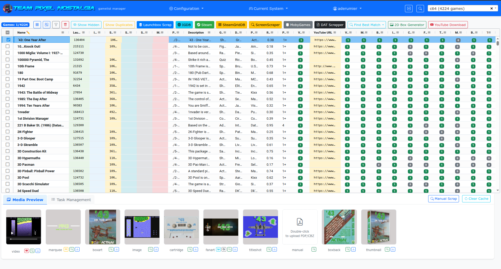

### Key Highlights

- 🎮 **Multi-Platform Support**: Works with various ROM systems (MAME, NES, GBA, Sega Genesis, PlayStation, and many more)
- 📊 **Rich Metadata**: Automatically scrape and manage game information from multiple sources
- 🖼️ **Media Management**: Comprehensive media file handling (box art, screenshots, videos, marquees, etc.)
- 🔄 **Real-Time Collaboration**: WebSocket-based real-time updates for multi-user environments
- 🌐 **Web-Based Interface**: Modern, responsive UI accessible from any device
- 🐳 **Docker Ready**: Easy deployment with Docker and Docker Compose
- 🔐 **Secure**: User authentication with Discord OAuth2 support

---

## Features Overview

### Core Capabilities

- **Game Collection Management**
  - View, edit, and organize games in an intuitive grid interface
  - Support for multiple ROM systems simultaneously
  - Quick search and filtering
  - Bulk operations on games

- **Media Management**
  - Automatic media file scanning and linking
  - Image and video preview with hover tooltips
  - Upload, delete, and rotate media files
  - Media field remapping and organization
  - 2D box art generation from multiple images
  - Video screenshot capture from current playback position

- **Metadata Scraping**
  - **LaunchBox Integration**: Import metadata and media from LaunchBox XML databases
  - **IGDB Integration**: Fetch game information, artwork, and videos from IGDB
  - **ScreenScraper**: Retro gaming metadata and media
  - **SteamGridDB**: Steam game grid artwork
  - **MobyGames**: Comprehensive game database
  - **YouTube**: Video download and integration
  - **Fanart.tv**: High-quality game artwork

- **Task Management**
  - Background task queue system
  - Real-time progress updates via WebSocket
  - Task history and logging
  - Cancellable long-running operations

- **User Management**
  - Multi-user support
  - Role-based access control
  - Discord OAuth2 authentication
  - User registration and validation


---

## Installation

### Prerequisites

- **Operating System**: Linux (Debian 13+, Ubuntu 25.04+)
- **Python**: 3.11 or higher
- **Web Browser**: Modern browser with JavaScript enabled

### Docker

```bash
# Pull the latest image
docker pull aderumier/emulationstation_gamemanager:latest

# Run with Docker Compose
docker compose up -d

# Or run directly
docker run -d \
  --name gamemanager \
  -p 5000:5000 \
  -v $(pwd)/roms:/opt/gamemanager/roms \
  -v $(pwd)/var:/opt/gamemanager/var \
  aderumier/emulationstation_gamemanager:latest
```


### Debian/Ubuntu Package Installation

```bash
# Download the .deb package
wget https://github.com/aderumier/emulationstation_gamemanager/releases/download/v2.9.1/gamemanager_2.9.1-1_all.deb

# Install
sudo dpkg -i gamemanager_2.9.1-1_all.deb

# Fix dependencies if needed
sudo apt-get install -f
```

### Manual Installation

For detailed installation instructions, see:
- [Docker Deployment Guide](DOCKER_DEPLOYMENT.md)
- [Debian Package Installation](INSTALL_DEB.md)
- [README.md](README.md) - Manual installation steps

---

## Getting Started

### First Launch

1. **Start the Application**
   ```bash
   python3 app.py
   # Or using Docker
   docker compose up
   ```

2. **Access the Web Interface**
   - Open your browser: `http://localhost:5000`
   - Default admin credentials:
     - Username: `admin`
     - Password: `admin123`
     - ⚠️ **Change immediately after first login!**

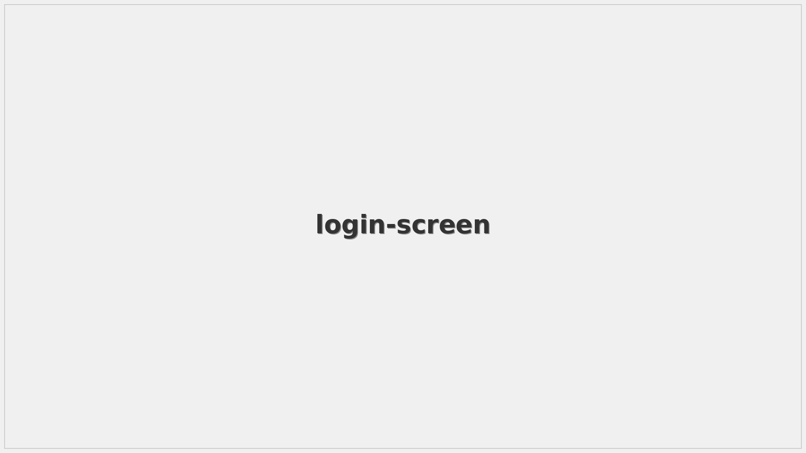

3. **Download the launchbox database && update the local scrappers databases**

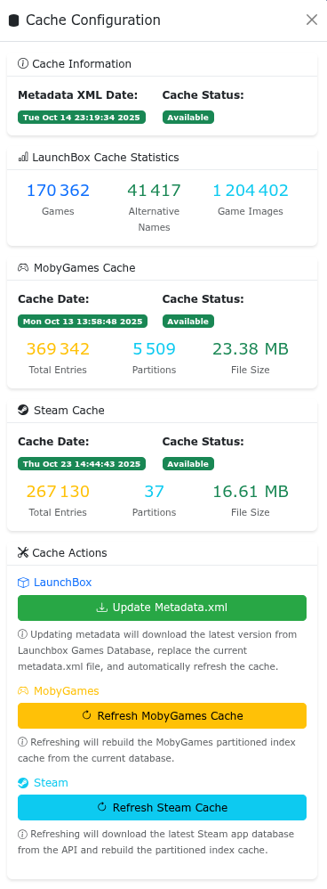

4. **Configure Your ROM Directory**
   - Go to **Configuration → Application Config**
   - Set the ROMs root directory path
   - Configure other settings as needed

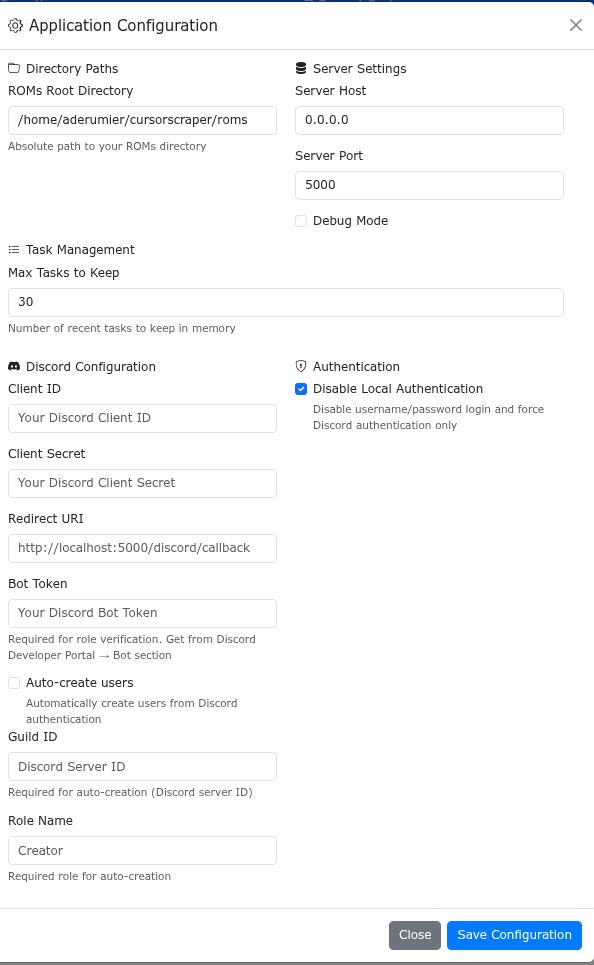

5. **Configure Your systems**
   - Go to **Configuration → System Configuration**
   - Add the game systems that you have in your roms directory
   

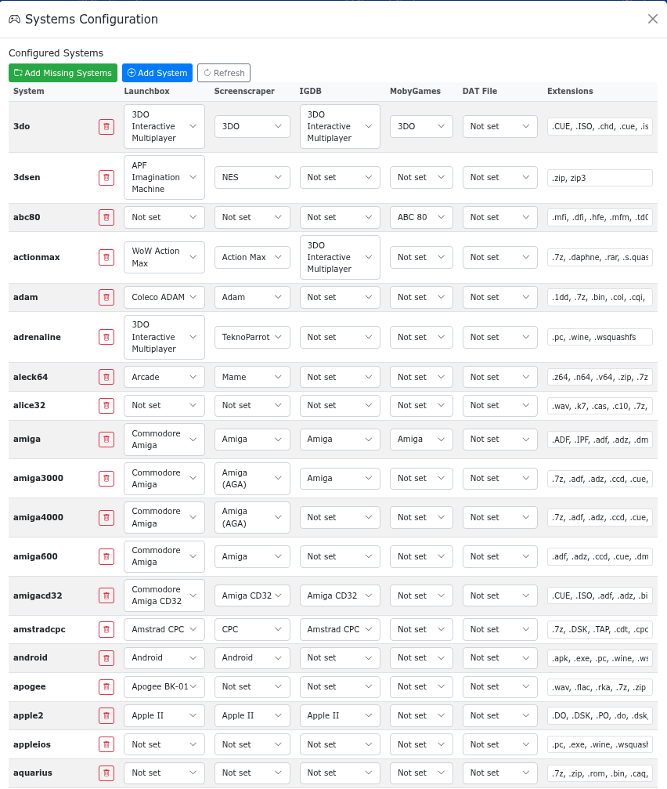

6. **Load a System**
   - Select a ROM system from the dropdown
   - The game list will automatically load from `roms/<system>/gamelist.xml`

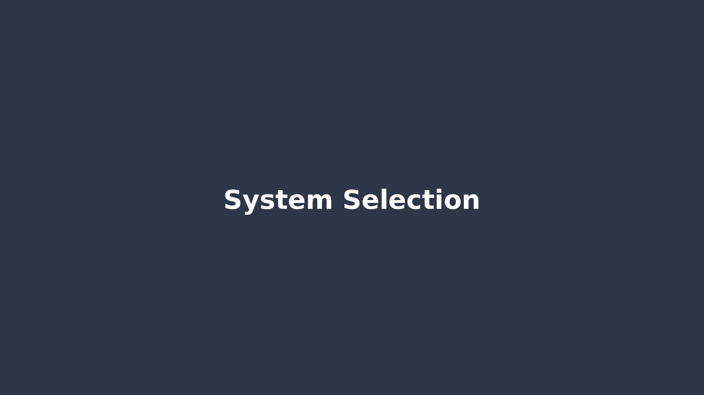

---

## User Interface

### Main Components

#### 1. Navigation Bar

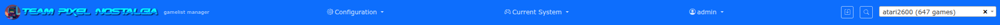

- **System Selector**: Choose the active ROM system


- **Configuration Menu**: Access all Application configuration options

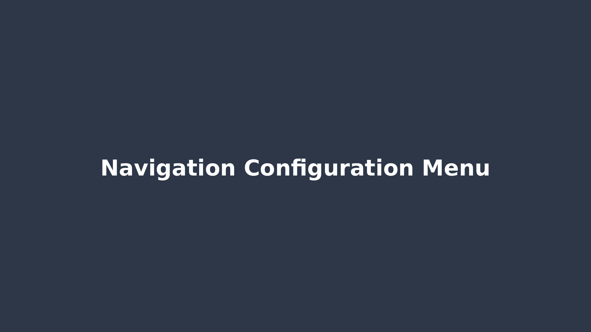
- **Current System Menu**: System-specific operations

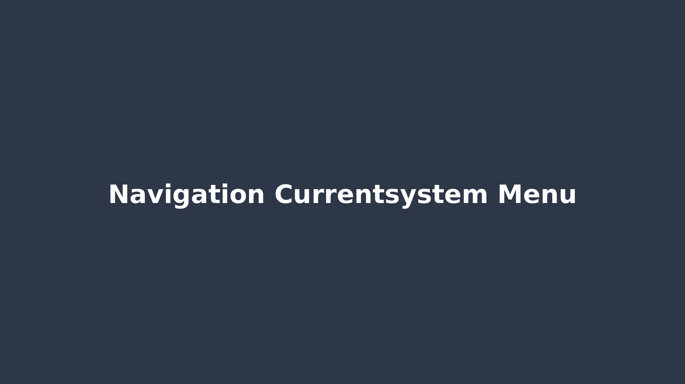
- **User Menu**: Account settings, User Automatic Scrappers preferences and logout


#### 2. Game Grid

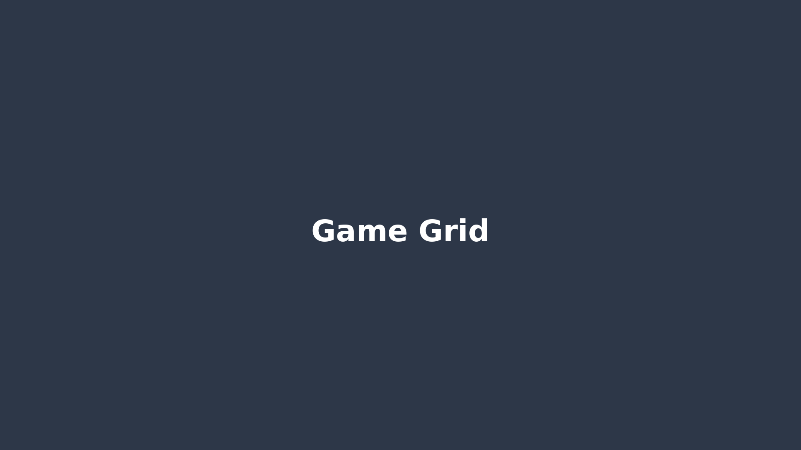

The main game grid displays all games in the current system with columns for:
- **Name**: Game title (editable)
- **Path**: ROM file path
- **Description**: Game description
- **Genre, Developer, Publisher**: Metadata fields
- **Media Fields**: Thumbnails and preview icons
- **IDs**: LaunchBox, IGDB, Screenscraper, Steam, etc.
- **YouTube URL**: Video link

**Features**:
- Sortable columns
- Filterable/searchable
- Column visibility toggle
- Resizable columns
- Dark mode support
- Thumbnail grid view

#### 3. Media Preview Pane

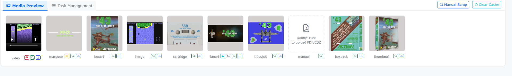

Right-side panel showing:
- All media files for selected game
- Large preview images with hover tooltips
- Action buttons (rotate, delete, upload)
- Field labels and organization

#### 4. Task Management Panel

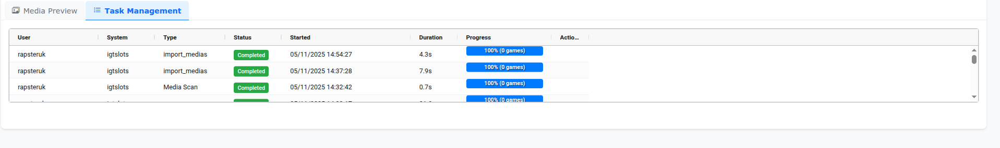

Bottom panel displaying:
- Active background tasks
- Task progress and status
- Task history
- Cancel buttons for running tasks

You can double click on a task to see the detailled task log. (Also in Live!)
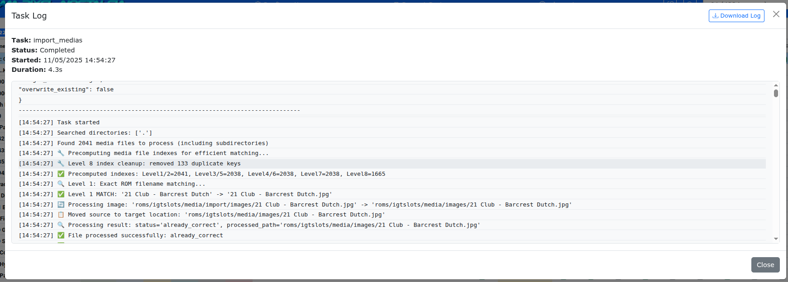

---

## Core Features

### Game Management

#### Viewing Games

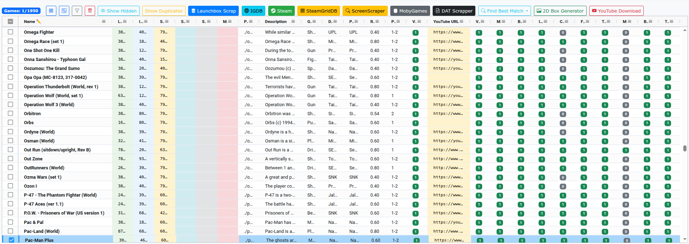

- **Grid View**: Default view with all columns
- **Thumbnail View**: Card-based view with large thumbnails
- **Toggle**: Use the view switcher in the toolbar

#### Editing Games

1. **Quick Edit**: Double-click a cell to edit inline
2. **Full Edit Modal**: Click the edit button or double-click the name column

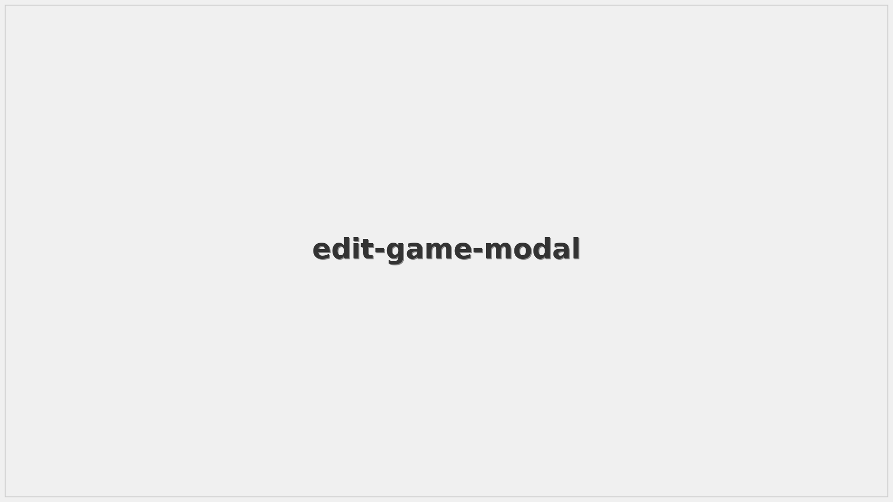

**Edit Modal Tabs**:
- **Game Information**: Metadata fields, IDs, descriptions
- **Media Files**: View and manage all media files
- **Video Preview**: Preview and manage video files

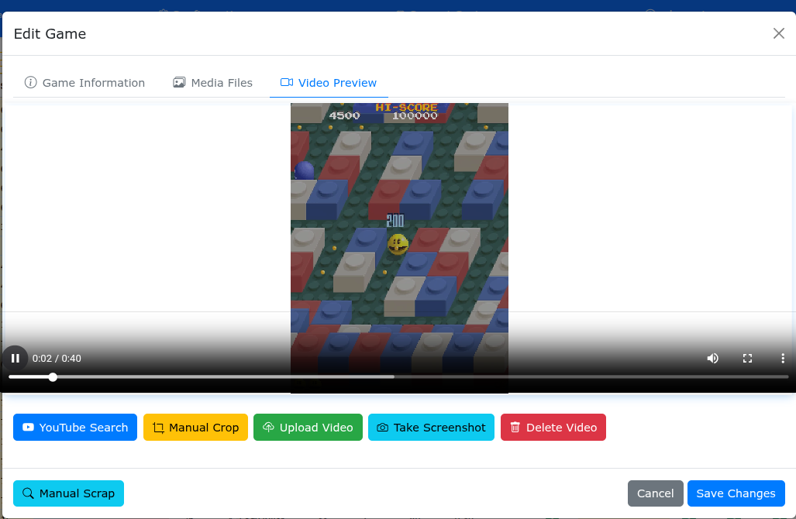

#### Adding Games

Games are automatically added when:
- ROM files are placed in the system directory
- `gamelist.xml` is imported/refreshed

Manual addition:
1. Place ROM file in `roms/<system>/` directory
2. Click **"Force Import gamelist.xml"** from Current System menu
3. Game appears in the grid

#### Deleting Games

- **Single Game**: Right-click → Delete, or use the delete button
- **Multiple Games**: Select games (checkbox column) → Delete Selected
- Confirmation dialog appears before deletion


### Media Management

#### Media Types Supported

- **Images**: `image`, `marquee`, `titleshot`, `boxart`, `fanart`, `screenshot`
- **Videos**: `video`, `video_mp4`, `video_avi`, `video_mov`, `video_mkv`
- **Other**: Custom media fields as configured


#### Uploading Media

1. Open **Edit Game Modal** → **Media Files** tab
2. Click **Upload** button for the desired media field
3. Select file from your computer
4. File is automatically:
   - Saved to the correct media directory
   - Processed (converted/resized if configured)
   - Linked in `gamelist.xml`

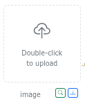

#### Rotating Images

1. Click on an image in the media preview
2. Context menu appears
3. Select **Rotate Left** or **Rotate Right**
4. Image is rotated and saved atomically

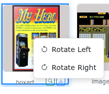

#### Taking Screenshots from Videos

1. Open **Edit Game Modal** → **Video Preview** tab
2. Play the video and navigate to desired frame
3. Click **"Take Screenshot"** button
4. Preview modal appears with captured screenshot
5. Select target field (image or titleshot)
6. Click **Validate** to save

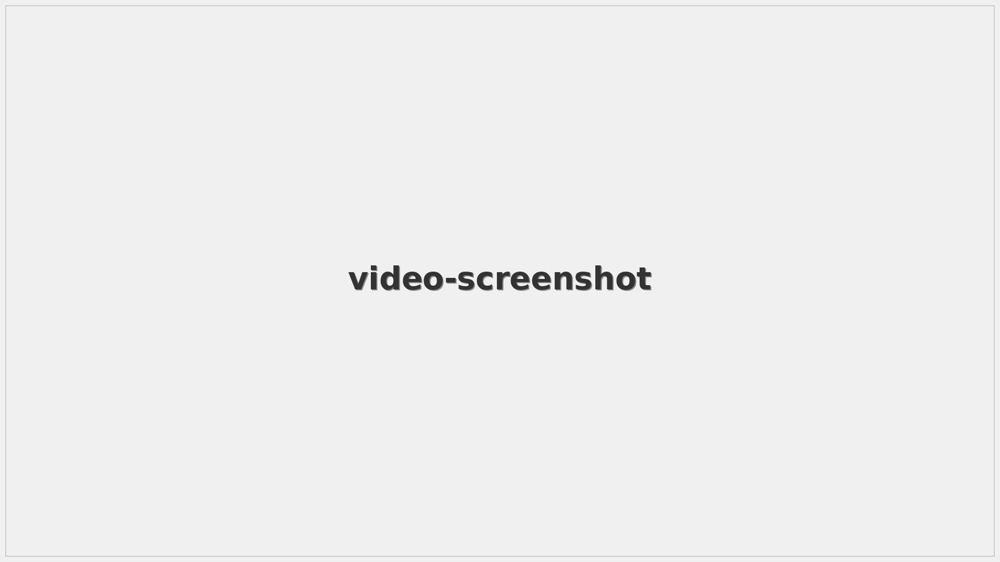

**Note**: Screenshot feature captures the current video frame using HTML5 Canvas API.

#### Manual Video Cropping

Manual video cropping allows you to remove black borders or unwanted areas from game videos by visually selecting the crop area on a video frame.

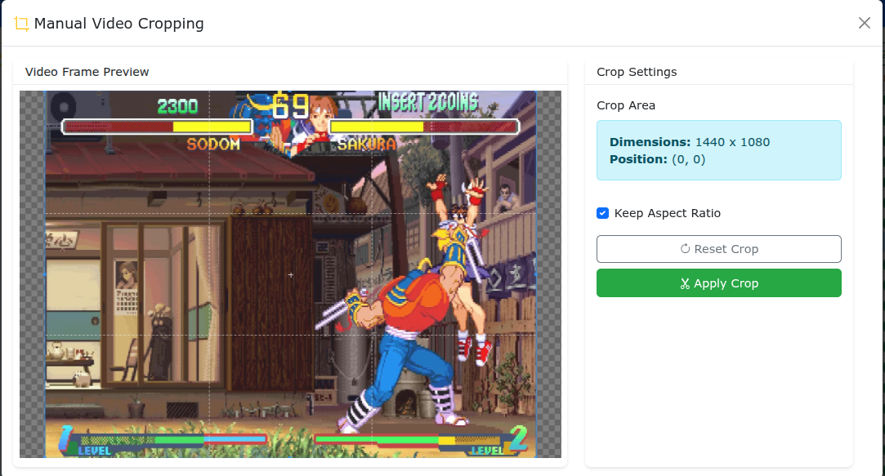

**How to Use Manual Video Cropping:**

1. **Open Edit Game Modal** → **Video Preview** tab
2. Ensure the game has a video file (supports: `video`, `video_mp4`, `video_avi`, `video_mov`, `video_mkv`)
3. Click the **"Manual Crop"** button (enabled when a video is present)
4. The **Manual Video Cropping** modal opens:
   - **Left Panel**: Shows a preview frame extracted from the middle of the video
   - **Right Panel**: Crop settings and controls
5. **Select Crop Area**:
   - Click and drag on the preview image to select the area you want to keep
   - The crop area is displayed with a selection rectangle
   - Use the **"Keep Aspect Ratio"** checkbox to maintain proportions
6. **Adjust Crop Settings**:
   - View real-time crop dimensions and position in the info panel
   - Click **"Reset Crop"** to clear the selection and start over
7. **Apply Crop**:
   - Click **"Apply Crop"** to process the video
   - The system will:
     - Extract the selected crop area from the entire video
     - Create a new cropped video file
     - Replace the original video with the cropped version
     - Update the `gamelist.xml` file with the new video path

**Technical Details:**

- **Frame Extraction**: The system extracts a frame from the middle of the video to use as a preview
- **Crop Format**: Crop dimensions are specified as `width:height:x:y` (e.g., `1920:1080:0:0`)
- **Video Processing**: Uses FFmpeg to apply the crop filter to the entire video
- **File Replacement**: The original video is replaced with the cropped version
- **Supported Formats**: Works with MP4, AVI, MOV, MKV, and other FFmpeg-supported video formats

**Tips:**

- Extract a representative frame from the middle of the video for accurate cropping
- Use "Keep Aspect Ratio" to maintain proper video proportions
- The crop area can be adjusted by dragging the corners or edges of the selection rectangle
- The preview frame is automatically cleaned up after closing the modal

**Note**: Manual cropping processes the entire video, not just a single frame. The crop area you select is applied to all frames of the video.

#### Deleting Media

- **Single Media**: Click media item → Context menu → Delete
- **Multiple Media**: Select items → **Delete Selected Media** button
- Files are removed from disk and `gamelist.xml` is updated

### Media Field Remapping

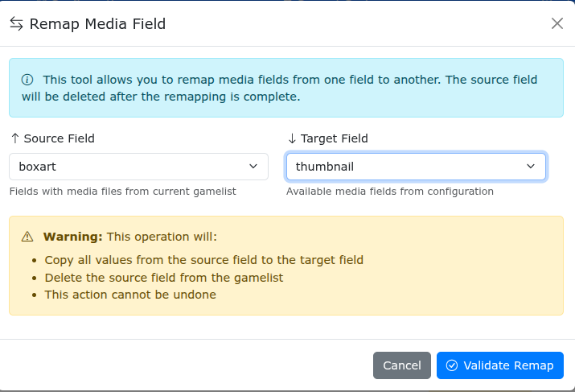

**Purpose**: Reorganize media files into different field mappings

**Process**:
1. Go to **Current System → Remap Media Fields**
2. Select source and target media fields
3. System moves files and updates `gamelist.xml`
4. Task runs in background with progress updates

### Media Operations

#### Move Medias
- Move media files between different media types
- Preserves files, updates `gamelist.xml` references

#### Resize Medias
- Batch resize images to configured dimensions
- Applies to all media in current system
- Uses ImageMagick for processing

#### Import Medias
- Import media files from external sources
- Supports folder scanning and automatic linking

#### Clean Missing Media Fields
- Scans all games for missing media files
- Removes broken references from `gamelist.xml`
- Select specific field or clean all fields

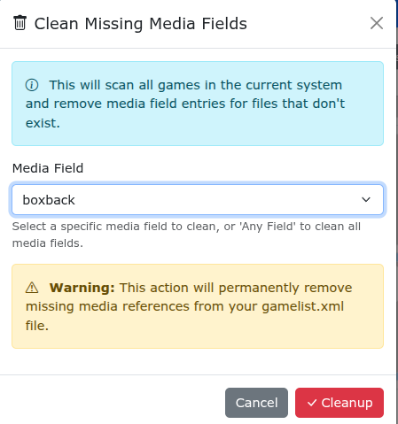

---

## Scraping & Media Management

### Available Scrapers

#### 1. LaunchBox

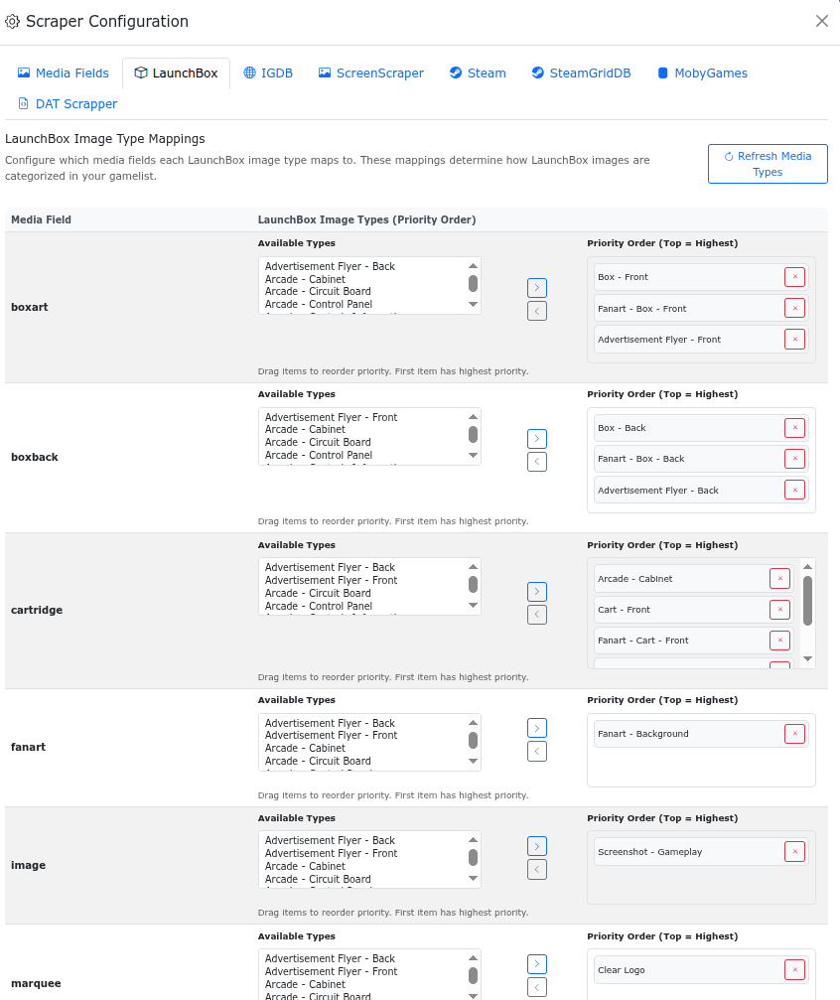

**Capabilities**:
- Import metadata from LaunchBox XML databases
- Download media files (box art, screenshots, videos, etc.)
- Automatic platform matching
- Region priority support

**Setup**:
1. Download LaunchBox Metadata.xml
2. Place in `var/db/launchbox/Metadata.xml`
3. Configure in **Configuration → Cache Management**

#### 2. IGDB

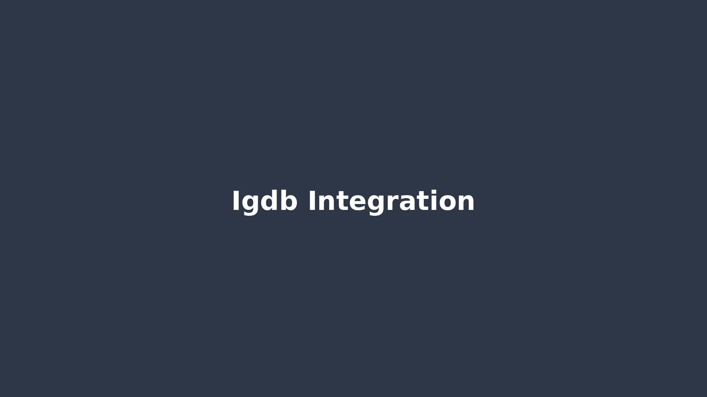

**Capabilities**:
- Comprehensive game database
- High-quality artwork (covers, screenshots, artworks, logos)
- Video downloads
- Company and genre information


#### 3. ScreenScraper

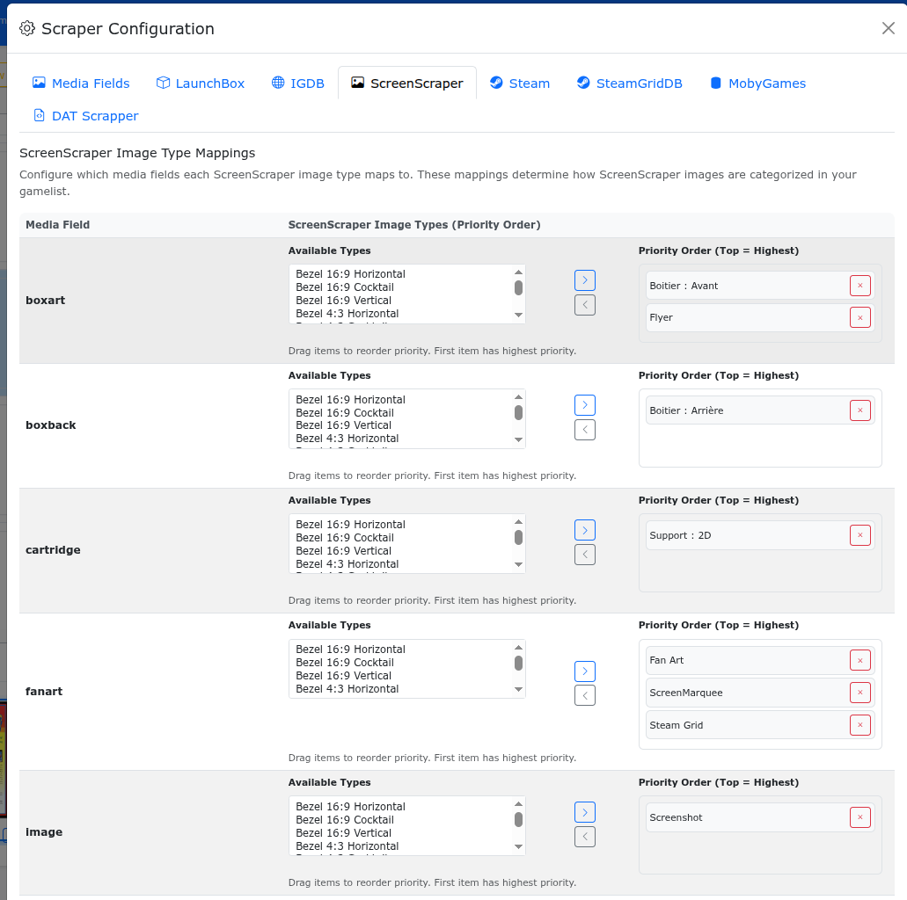
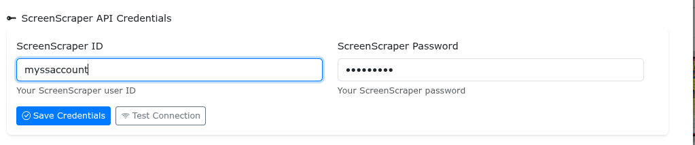

**Capabilities**:
- Retro gaming focus
- Regional media variants
- High-resolution scans
- Manual scrap with region selection

**Setup**:
- Configure credentials in **Configuration → Scraper Configuration**
- Free tier available with rate limiting

#### 4. SteamGridDB

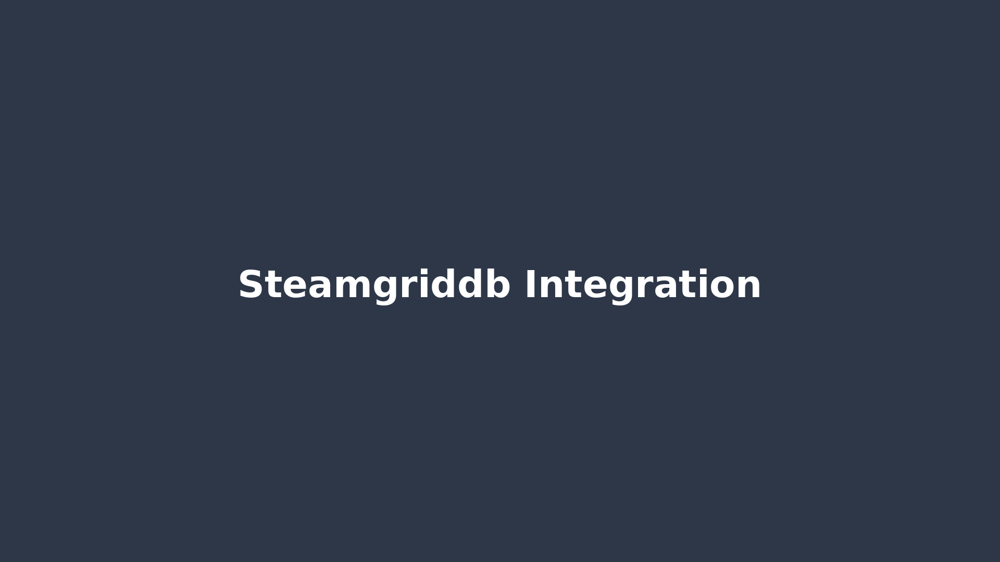

**Capabilities**:
- Steam game grid artwork
- Logos and hero images
- Community-submitted content

#### 5. MobyGames

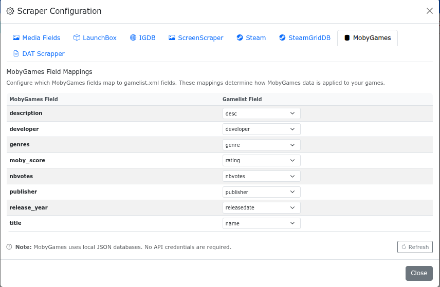

**Capabilities**:
- Extensive game database
- Historical game information
- Screenshots and box art

#### 6. Steam

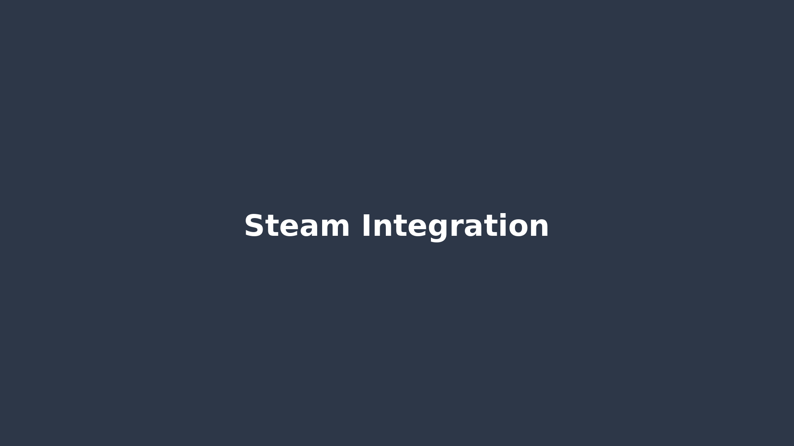

**Capabilities**:
- Steam game database matching
- Steam app metadata and information
- Game matching via Steam App ID
- Steam API integration for app discovery
- Find best match functionality for Steam games

**Setup**:
1. Steam integration uses the public Steam API (no authentication required)
2. The system automatically downloads and caches the Steam app list
3. Steam app index is cached locally in `var/db/steam/appindex.json`
4. Cache is automatically refreshed every 24 hours

**How It Works**:
- **App Index**: Downloads complete Steam app database from Steam API
- **Game Matching**: Matches ROM names against Steam app names
- **Normalization**: Removes parentheses and special characters for better matching
- **Exact Matching**: Prioritizes exact matches for fast results
- **Find Best Match**: Available in Find Best Match dropdown for bulk matching

**Use Cases**:
- Matching PC games and Steam releases
- Finding Steam App IDs for games
- Validating game names against Steam database
- Bulk matching multiple games against Steam catalog

**Note**: Steam integration is primarily for game matching and identification. For Steam-specific artwork, use SteamGridDB integration.

#### 7. DAT Scrapper

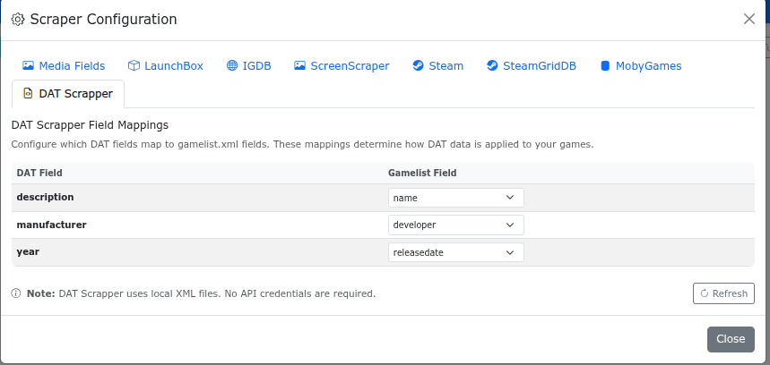

**Capabilities**:
- DAT file-based game matching
- ROM set validation and identification
- Exact ROM filename matching
- Case-insensitive matching support
- Find best match functionality for DAT files

**Setup**:
1. Place DAT files in the configured DAT directory
2. Configure DAT file mapping in **Configuration → Systems Configuration**
3. Map each system to its corresponding DAT file
4. DAT files are automatically loaded when needed

**How It Works**:
- **DAT File Loading**: Loads DAT files configured for each system
- **ROM Name Matching**: Matches ROM filenames (without extension) against DAT entries
- **Direct Matching**: First tries exact filename match
- **Case-Insensitive**: Falls back to case-insensitive matching if needed
- **Find Best Match**: Available in Find Best Match dropdown for bulk matching

**DAT File Format**:
- Supports standard DAT file formats (No-Intro, Redump, etc.)
- Each DAT entry contains game name and ROM filename
- System-specific DAT files for accurate matching

**Use Cases**:
- Validating ROM sets against official DAT files
- Identifying unknown ROM files
- Matching ROM filenames to proper game names
- ROM collection organization and verification
- Bulk identification of ROM files

**Configuration**:
- Go to **Configuration → Systems Configuration**
- Select a system
- Choose the corresponding DAT file from the dropdown
- Save configuration

**Note**: DAT Scrapper is essential for ROM set validation and ensuring your collection matches official DAT file specifications.

#### 8. YouTube Integration

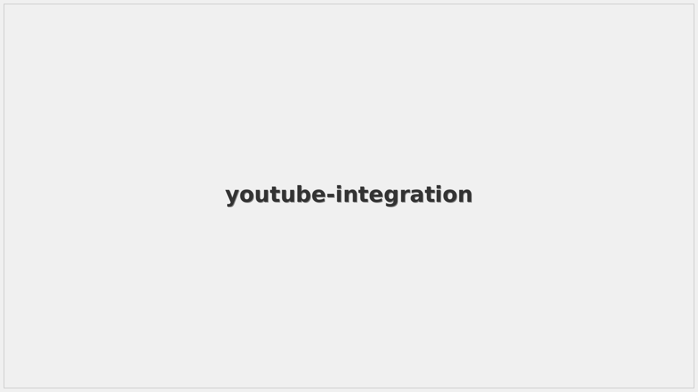

**Capabilities**:
- Video search and preview
- Download 30-second clips
- Automatic cropping (black border removal)
- Manual time selection
- PO Token provider support for restricted videos

**Setup**:
- Configure YouTube cookies (optional)
- Set up PO Token provider (optional, for restricted videos)
- See video configuration in **Configuration → Video Configuration**

### Manual Scraping

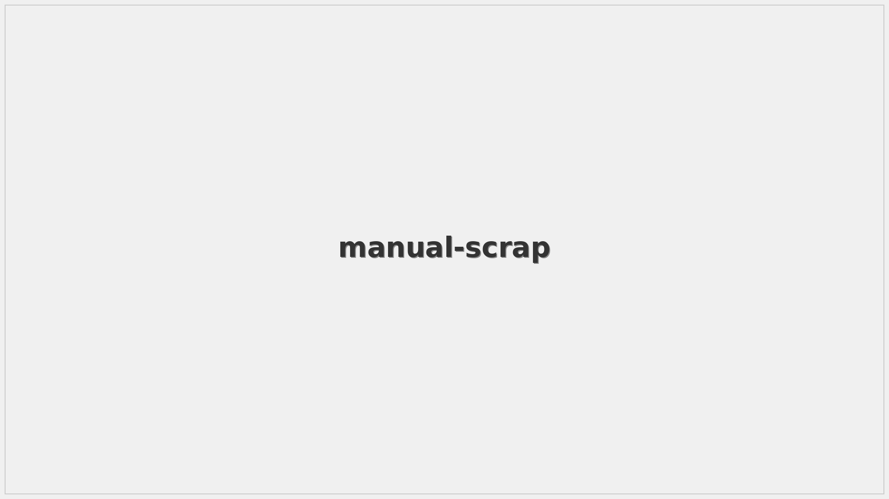

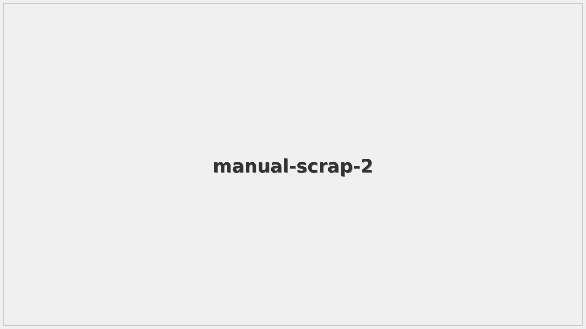

1. Select a game
2. Click **"Manual Scrap"** button
3. Search for the game across all scrapers
4. View results with previews
5. Select desired media and download
6. Media is automatically processed and linked

**Features**:
- Multi-scraper search
- Region selection
- Resolution display
- Preview before download

### Multiscraper Media Download

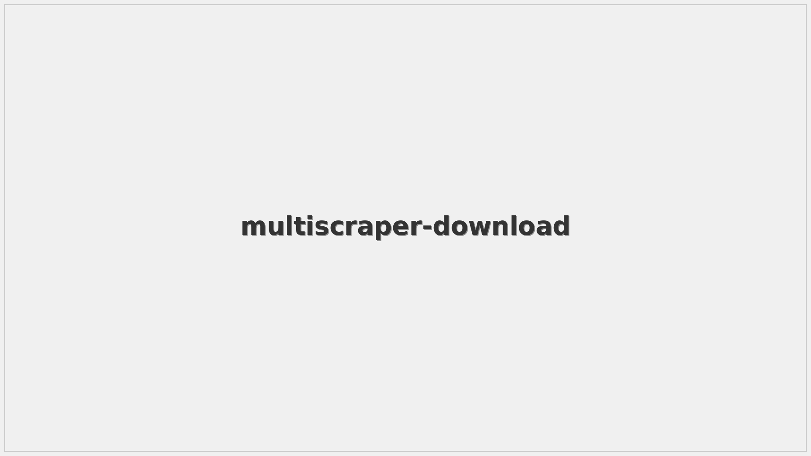

**Workflow**:
1. Search across all configured scrapers
2. View all available media options
3. Select specific images/videos
4. Download selected items
5. Automatic processing and integration

### Find Best Match
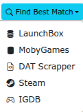


**Purpose**: Automatically find and match games with metadata sources using intelligent similarity matching algorithms. This feature helps you quickly identify and link your ROM files with accurate metadata from various databases.

**How to Use Find Best Match:**

#### From Main Interface (Bulk Matching)

1. **Select Games**: 
   - Select one or more games from the game grid (use checkboxes or Ctrl/Cmd+Click)
   - The **"Find Best Match"** button becomes enabled when games are selected

2. **Choose Scraper Source**:
   - Click the **"Find Best Match"** dropdown button
   - Select the scraper source:
     - **LaunchBox**: Match against LaunchBox metadata database
     - **MobyGames**: Match against MobyGames database
     - **DAT Scrapper**: Match against DAT file entries
     - **Steam**: Match against Steam game database
     - **IGDB**: Match against IGDB database

3. **Review Matches**:
   - A modal opens showing match results for each selected game
   - Each game displays:
     - **Original Name**: Your ROM file name
     - **Matched Name**: The best match found in the database
     - **Similarity Score**: Confidence level (0-100%)
     - **Database ID**: Unique identifier for the matched entry
     - **Preview**: Thumbnail or metadata preview if available

4. **Apply Matches**:
   - Review each match and adjust if needed
   - Click **"Apply Selected Matches"** to update all games
   - Or click individual **"Apply"** buttons for specific games
   - Metadata and media links are automatically updated

#### From Game Edit Modal (Single Game)

1. **Open Edit Game Modal**: Click on a game to edit
2. **Click "Find Best Match"**: Button located in the game edit modal
3. **Select Algorithm** (optional): Choose similarity algorithm from dropdown
4. **Review Matches**: Modal shows top matches with similarity scores
5. **Select Match**: Click on the desired match to apply it
6. **Save Changes**: Metadata is updated immediately

**Supported Scrapers:**

- **LaunchBox**: Comprehensive metadata from LaunchBox XML databases
  - Requires LaunchBox Metadata.xml file
  - Matches by game name and alternate names
  - Platform-specific matching based on system configuration

- **MobyGames**: Extensive historical game database
  - System-specific matching (uses configured MobyGames platform)
  - High-quality metadata and game information
  - Supports alternate names and variations

- **DAT Scrapper**: DAT file-based matching
  - Matches against configured DAT files
  - Useful for ROM set validation and identification

- **Steam**: Steam game database matching
  - Matches against Steam app database
  - Useful for PC games and Steam releases

- **IGDB**: IGDB database matching
  - Requires IGDB platform configuration
  - Comprehensive modern game database
  - High-quality metadata and artwork

**Similarity Algorithms:**

The system uses string similarity algorithms to find the best matches. You can select which algorithm to use:

- **Jaro-Winkler** (default): Best for names with common prefixes
  - Weighted towards strings that share a common prefix
  - Good for detecting typos and variations
  - Recommended for most use cases

- **Damerau-Levenshtein**: Accounts for transpositions
  - Considers character swaps (e.g., "ab" vs "ba")
  - Good for detecting common typos

- **Levenshtein**: Classic edit distance algorithm
  - Measures minimum edits needed to transform one string to another
  - Good general-purpose matching

- **Jaro**: Similarity based on matching characters
  - Considers character order and position
  - Good for names with similar structure

- **Hamming**: Distance between strings of equal length
  - Only works for strings of the same length
  - Fast but limited use case

**Features:**

- **Bulk Processing**: Match multiple games simultaneously
- **Preview Before Apply**: Review all matches before committing changes
- **Similarity Scoring**: See confidence levels for each match
- **Alternate Name Matching**: Finds matches even with different naming conventions
- **Platform-Specific**: Only searches within the configured platform/system
- **Real-Time Preview**: See metadata previews before applying
- **Manual Override**: Edit game name manually if automatic matching fails

**Tips:**

- Use **Jaro-Winkler** algorithm for best results with most game names
- Select multiple games for bulk matching to save time
- Review similarity scores - matches above 80% are usually reliable
- Check alternate names if the primary match doesn't look right
- Use platform-specific scrapers (MobyGames, IGDB) for more accurate results
- The system normalizes game names (removes special characters, articles) for better matching

### YouTube Video Download

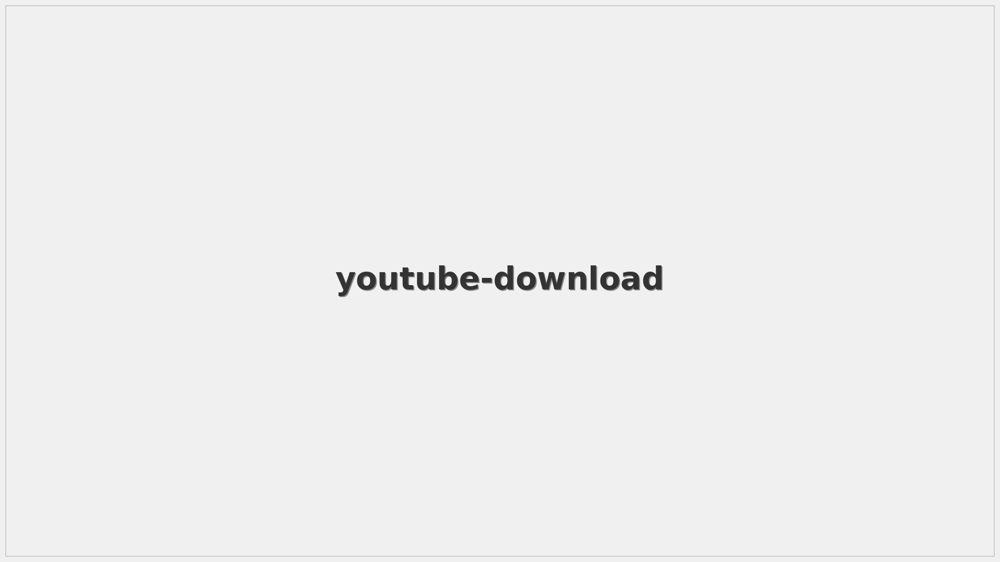

**Features**:
- Preview video in embedded player
- Select start time for 30-second clip
- Automatic black border detection and cropping
- Batch download support
- Cookie support for restricted videos
- PO Token provider for age-restricted content

**Workflow**:
1. Enter YouTube URL in game edit modal
2. Click **"YouTube Search"** or preview button
3. Preview video and select start time
4. Enable auto-crop if needed
5. Download clip
6. Video is processed and linked to game

### LaunchBox Media Download
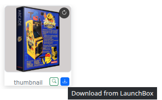

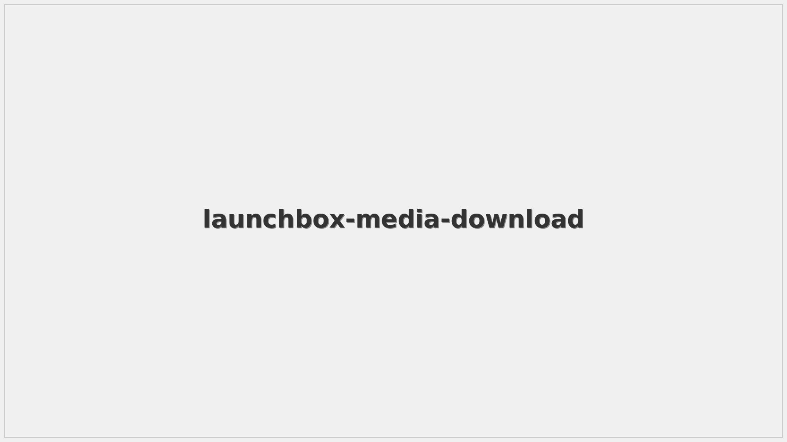

**Process**:
1. Select game(s)
2. Choose media type(s) to download
3. System searches LaunchBox database
4. Shows available media with previews
5. Select and download
6. Automatic processing and integration

### Fanart Search

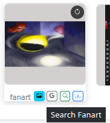

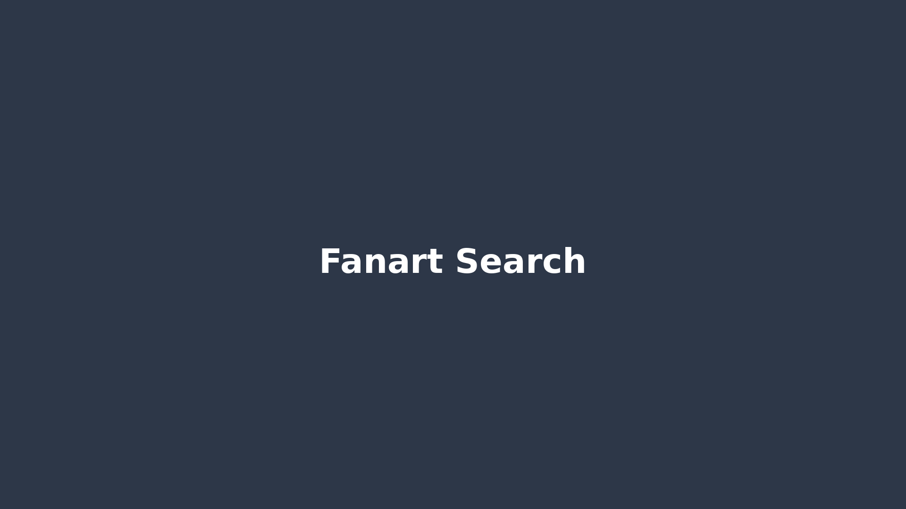

**Features**:
- Search Fanart.tv for game artwork
- High-resolution images
- Multiple image types
- Region and resolution information

### Marquee Search


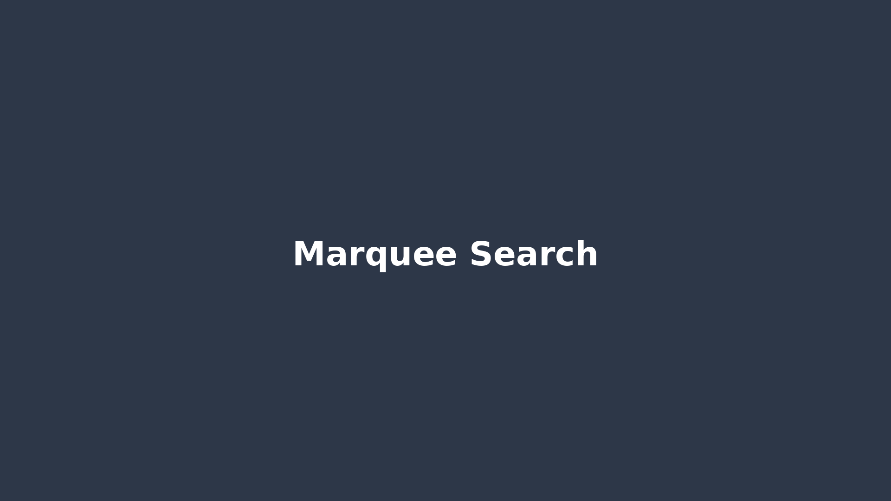

**Purpose**: Find and download arcade marquee images

**Features**:
- Specialized for arcade games
- Multiple sources
- Region selection

---

## Configuration

### Application Configuration


**Settings**:
- ROMs root directory
- Server host and port
- Debug mode
- Session settings
- File upload limits

### System Configuration


**Features**:
- Add/edit ROM systems
- Map to LaunchBox platforms
- Configure media field mappings
- Set system-specific settings

### Scraper Configuration

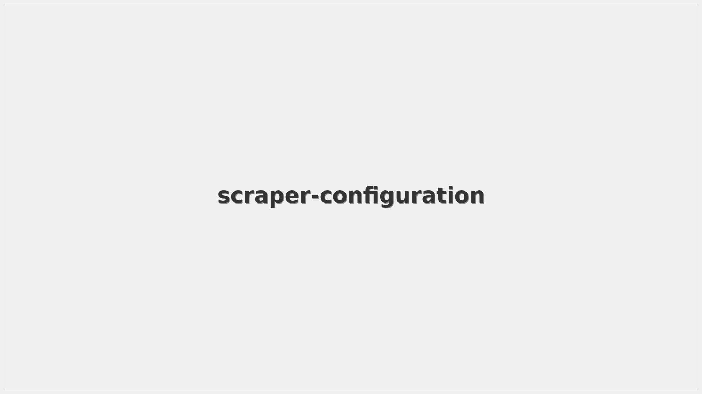

**Configure**:
- Media field mappings
- LaunchBox settings
- IGDB settings
- ScreenScraper credentials
- Rate limiting
- Region priorities

### Video Configuration

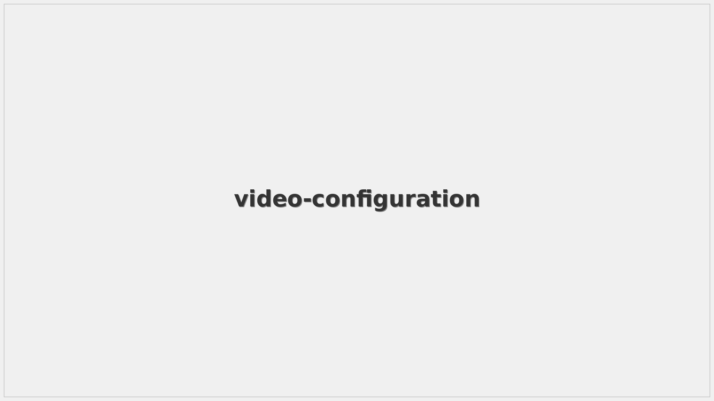

**Settings**:
- Force video resolution
- YouTube API key
- YouTube cookies (for restricted videos)
- PO Token provider (for age-restricted content)
- Auto-crop settings
- Cookie skip duration threshold

### 2D Box Generator Configuration

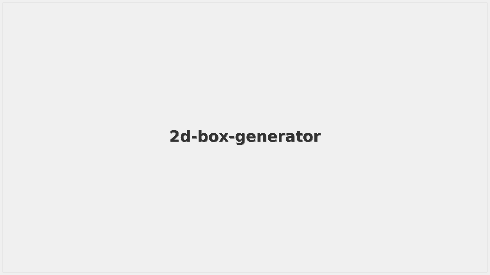

**Features**:
- Configure box art generation from multiple images
- Set dimensions and layout
- Template customization
- Image positioning

### GUI Preferences

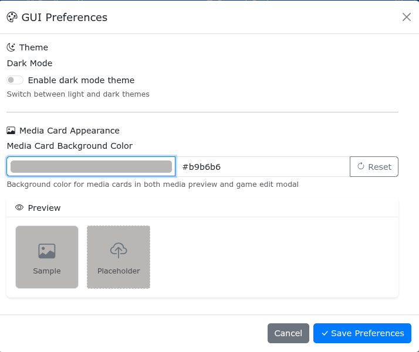

**Options**:
- **Dark Mode**: Toggle dark/light theme
- **Media Card Background Color**: Customize media preview background
- **Column Visibility**: Show/hide grid columns
- **Similarity Algorithm**: Choose matching algorithm

**Dark Mode**:
- Fully themed interface
- AG Grid dark mode support
- Proper contrast for all elements

---

## Authentication & Security

### User Management

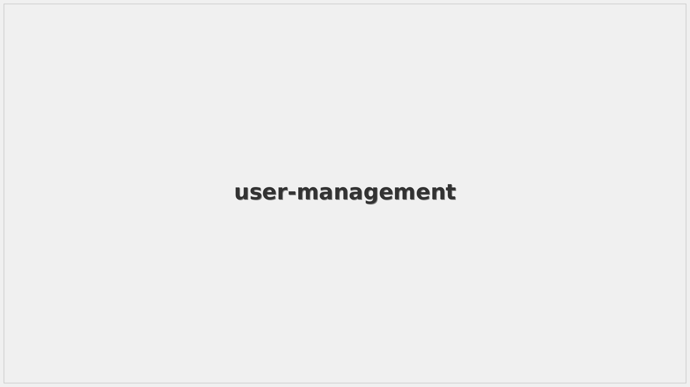

**Features**:
- Create and manage user accounts
- Role assignment (admin/user)
- User validation system
- Account activation/deactivation

### Authentication Methods

#### 1. Local Authentication

- Username/password login
- Password hashing with bcrypt
- Session management
- Password strength requirements

#### 2. Discord OAuth2

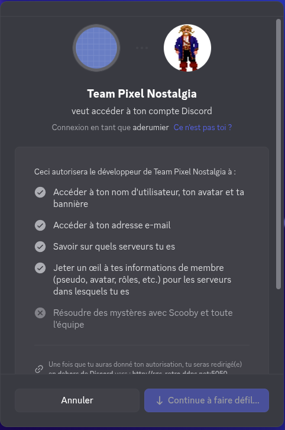

**Setup**:
- See [Discord Authentication Guide](DISCORD_AUTHENTICATION_GUIDE.md)
- Configure Discord application
- Set OAuth2 credentials
- Enable in application config

**Features**:
- Single Sign-On (SSO)
- Role verification
- Guild membership checks
- Automatic account creation

### Security Features

- Password hashing (bcrypt)
- Session security
- CSRF protection
- Secure cookie settings
- Role-based access control

---

## Advanced Features

### Real-Time Collaboration

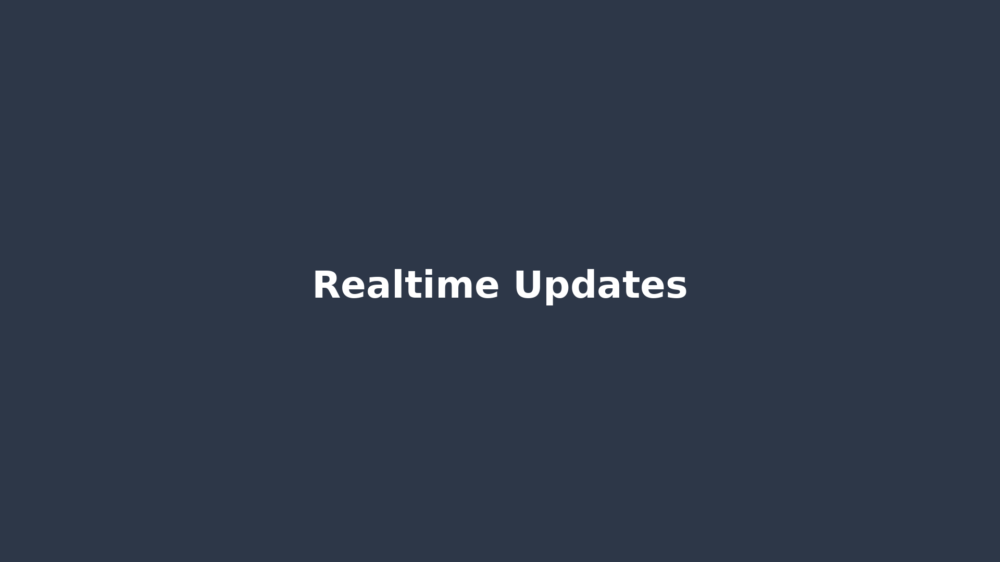

**WebSocket Support**:
- Real-time game grid updates
- Live media preview changes
- Collaborative editing
- System-specific rooms

**Events**:
- `gamelist_updated`: When gamelist.xml is saved
- `games_deleted`: When games are removed
- `game_updated`: When individual games are modified
- `system_updated`: General system updates

### Task Queue System

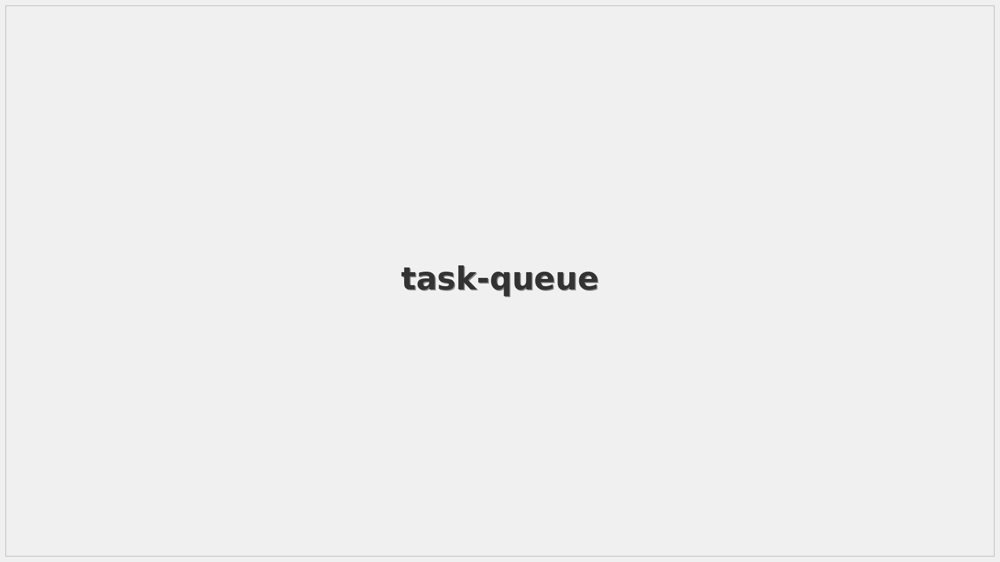

**Features**:
- Background task processing
- Real-time progress updates
- Task cancellation
- Task history and logging
- Priority queue support

**Task Types**:
- Media scraping
- Video downloads
- Media processing
- Gamelist imports
- Batch operations

### Media Processing

**Automatic Processing**:
- Image format conversion
- Image resizing
- Video transcoding
- Thumbnail generation
- Black border detection and cropping

**Configuration**:
- Per-field processing rules
- Target extensions
- Dimension settings
- Quality settings

### Thumbnail Grid View

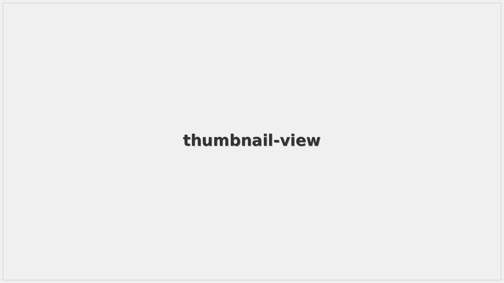

**Features**:
- Card-based game display
- Large media thumbnails
- Quick access to game info
- Responsive layout

### Search & Filtering

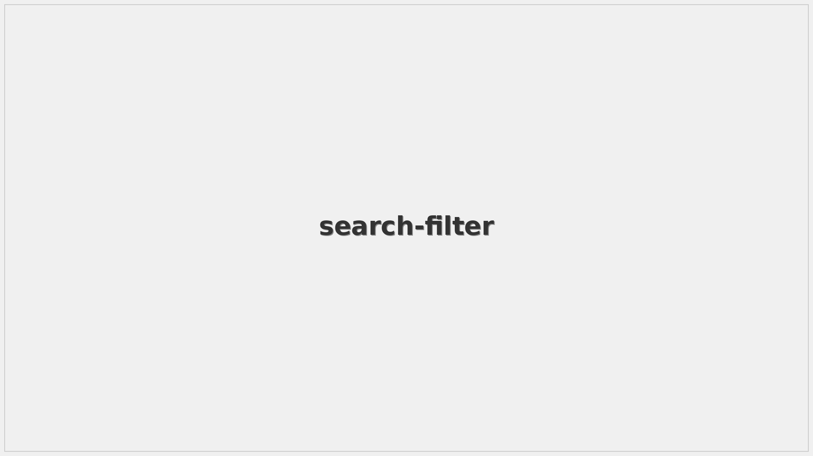

**Capabilities**:
- Full-text search across all columns
- Column-specific filtering
- Quick filters
- Saved filter presets

### Batch Operations

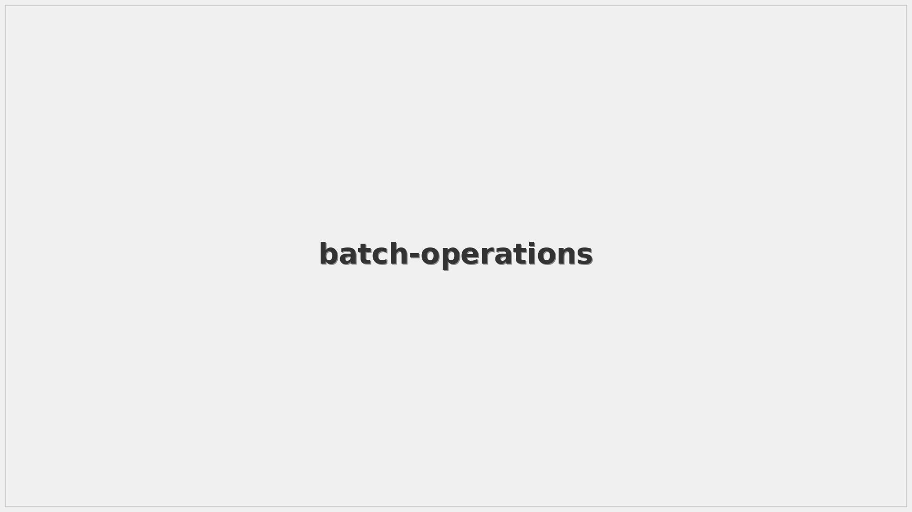

**Supported Operations**:
- Bulk metadata updates
- Batch media downloads
- Multiple game deletion
- Bulk field editing

---

## Deployment

### Docker Deployment

**Recommended Method**

```bash
# Using Docker Compose
docker compose up -d

# Or pull and run directly
docker pull aderumier/emulationstation_gamemanager:latest
docker run -d \
  --name gamemanager \
  -p 5000:5000 \
  -v $(pwd)/roms:/opt/gamemanager/roms \
  -v $(pwd)/var:/opt/gamemanager/var \
  aderumier/emulationstation_gamemanager:latest
```

**Volume Mounts**:
- `./roms` → ROM files and media
- `./var` → Configuration and databases
- `./var/config` → Application configuration
- `./var/db` → Scraper databases

**Environment Variables**:
- `IGDB_CLIENT_ID`: IGDB API Client ID
- `IGDB_CLIENT_SECRET`: IGDB API Client Secret
- `FLASK_ENV`: Production/development mode

For detailed instructions: [Docker Deployment Guide](DOCKER_DEPLOYMENT.md)

### Reverse Proxy Setup

#### Nginx

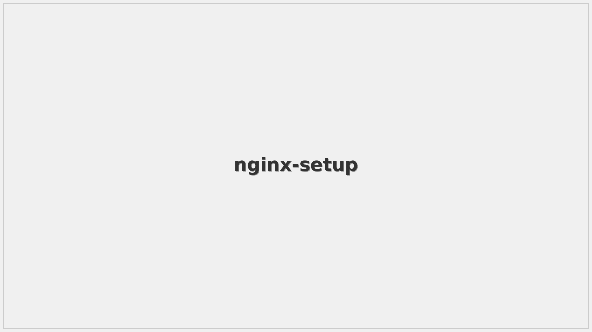

See [NGINX_SETUP.md](NGINX_SETUP.md) for complete configuration.

**Features**:
- HTTP/HTTPS support
- WebSocket support
- Large file uploads (500MB)
- Direct media file serving
- Smart caching

#### Apache

Similar configuration available for Apache reverse proxy.

### Systemd Service

For production deployment on Linux:

```bash
# Create service file
sudo nano /etc/systemd/system/gamemanager.service

# Enable and start
sudo systemctl enable gamemanager
sudo systemctl start gamemanager
```

See [README.md](README.md) for detailed systemd configuration.

---

## Troubleshooting

### Common Issues

#### Application Won't Start

**Symptoms**: Service fails to start, port already in use

**Solutions**:
```bash
# Check if port is in use
sudo netstat -tulpn | grep :5000

# Kill process using port
sudo kill -9 <PID>

# Check logs
journalctl -u gamemanager -f
```

#### Media Files Not Displaying

**Symptoms**: Thumbnails show placeholders, images don't load

**Solutions**:
- Check file permissions
- Verify media directory paths
- Check browser console for errors
- Ensure files exist in correct locations

#### Scraping Not Working

**Symptoms**: Scrapers return no results, errors in task logs

**Solutions**:
- Verify scraper credentials
- Check rate limiting settings
- Review task logs for specific errors
- Test API connectivity

#### Docker Issues

**Symptoms**: Container won't start, permission errors

**Solutions**:
```bash
# Check logs
docker logs gamemanager

# Fix permissions
sudo chown -R $USER:$USER ./roms ./var

# Rebuild container
docker compose down
docker compose build --no-cache
docker compose up -d
```

### Debug Mode

Enable debug mode in `var/config/config.json`:

```json
{
  "server": {
    "debug": true
  }
}
```

### Log Files

- **Application Logs**: `var/task_logs/`
- **System Logs**: `journalctl -u gamemanager` (systemd)
- **Docker Logs**: `docker logs gamemanager`

### Getting Help

- Check [README.md](README.md) for detailed troubleshooting
- Review task logs for specific error messages
- Check GitHub Issues for known problems
- Review configuration files for errors

---

## API Reference

### REST Endpoints

#### Game Management
- `GET /api/rom-system/<system>/games` - List games
- `POST /api/rom-system/<system>/game` - Create game
- `PUT /api/rom-system/<system>/game` - Update game
- `DELETE /api/rom-system/<system>/game` - Delete game

#### Media Management
- `POST /api/rom-system/<system>/game/upload-media` - Upload media file
- `POST /api/rom-system/<system>/game/rotate-media` - Rotate image
- `POST /api/rom-system/<system>/game/save-screenshot` - Save screenshot
- `GET /roms/<path>` - Serve ROM/media files

#### Scraping
- `POST /api/manual-scrap` - Manual scrape
- `POST /api/multiscraper-media` - Multiscraper download
- `POST /api/youtube/download` - Download YouTube video
- `POST /api/launchbox/media` - Download LaunchBox media

#### Task Management
- `GET /api/tasks` - List tasks
- `POST /api/task/cancel` - Cancel task

#### Configuration
- `GET /api/config` - Get configuration
- `POST /api/config` - Update configuration

### WebSocket Events

- `connect` - Client connection
- `disconnect` - Client disconnection
- `gamelist_updated` - Gamelist saved
- `game_updated` - Game modified
- `games_deleted` - Games removed
- `system_updated` - System changed

---

## Contributing

### Development Setup

1. Fork the repository
2. Clone your fork
3. Create a feature branch
4. Make changes
5. Test thoroughly
6. Submit pull request

### Code Style

- Follow PEP 8 for Python code
- Use meaningful variable names
- Add comments for complex logic
- Update documentation for new features

### Testing

- Test all new features manually
- Check for breaking changes
- Verify multi-user scenarios
- Test with different ROM systems

---

## Screenshots Required

The following screenshots are needed for complete documentation:

### Main Interface
- [ ] Main interface with game grid
- [ ] Navigation bar
- [ ] Media preview pane
- [ ] Task management panel

### Features
- [ ] Game edit modal (all tabs)
- [ ] Manual scrap interface
- [ ] Multiscraper results
- [ ] YouTube preview and download
- [ ] LaunchBox media download
- [ ] Media field remapping
- [ ] Clean missing media modal

### Configuration
- [ ] Application configuration modal
- [ ] Scraper configuration
- [ ] Video configuration
- [ ] GUI preferences
- [ ] Systems configuration

### Authentication
- [ ] Login screen
- [ ] User management
- [ ] Discord OAuth setup

### Advanced
- [ ] Thumbnail grid view
- [ ] Dark mode interface
- [ ] Task queue with progress
- [ ] Search and filtering
- [ ] Video screenshot feature

### Deployment
- [ ] Docker setup
- [ ] Nginx configuration
- [ ] Systemd service status

---

## License

This project is licensed under the GNU General Public License v3.0 - see the [LICENSE](LICENSE) file for details.

Copyright (C) 2024 Alexandre Derumier <aderumier@gmail.com>

---

## Acknowledgments

- **LaunchBox** for metadata and media databases
- **IGDB** for comprehensive game information
- **ScreenScraper** for retro gaming content
- **SteamGridDB** for Steam artwork
- **MobyGames** for historical game data
- All contributors and users of GameManager

---

## Version History

### Version 2.8.4 (Current)

**New Features**:
- Screenshot capture from video playback
- Clean missing media fields feature
- Dark mode theme support
- Improved media card background color integration
- Removed automatic gamelist.xml backups

**Improvements**:
- Enhanced YouTube PO Token Provider control
- Better image rotation reliability
- Improved task completion handling
- Updated Docker image build process

**Bug Fixes**:
- Fixed image rotation 404 errors
- Fixed dark mode grid styling
- Fixed media card color application
- Fixed YouTube PO token being used when disabled

### Previous Versions

See [CHANGELOG.md](CHANGELOG.md) for complete version history.

---

## Support & Contact

- **GitHub**: [Repository URL]
- **Issues**: [GitHub Issues URL]
- **Email**: aderumier@gmail.com
- **Documentation**: See all `.md` files in repository

---

**Last Updated**: 2024

**Documentation Version**: 1.0

