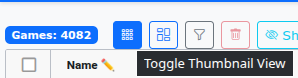
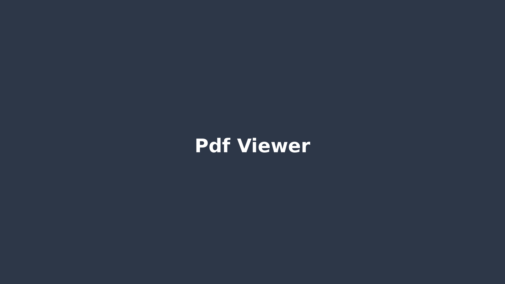
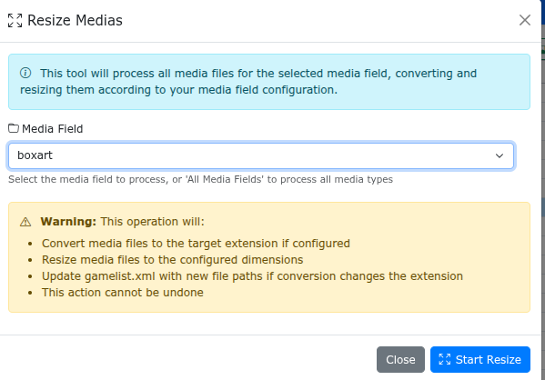
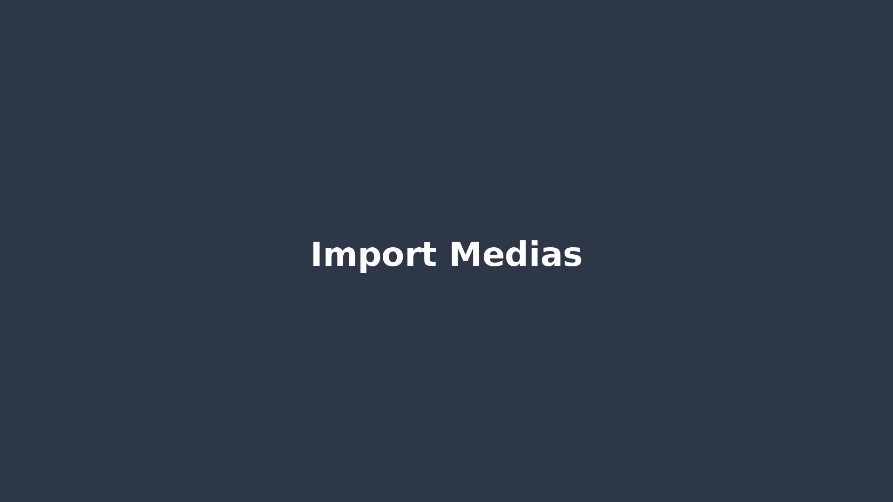
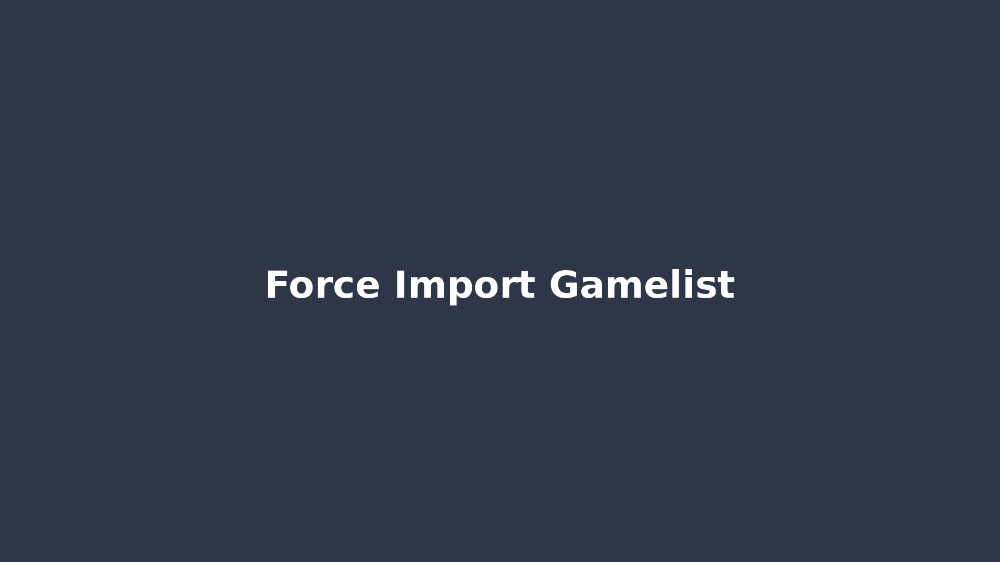
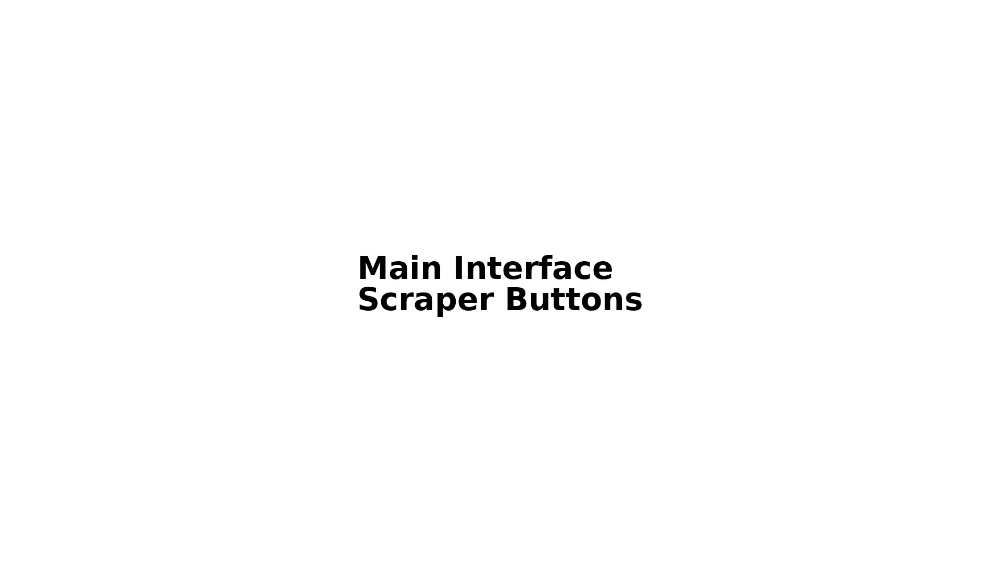
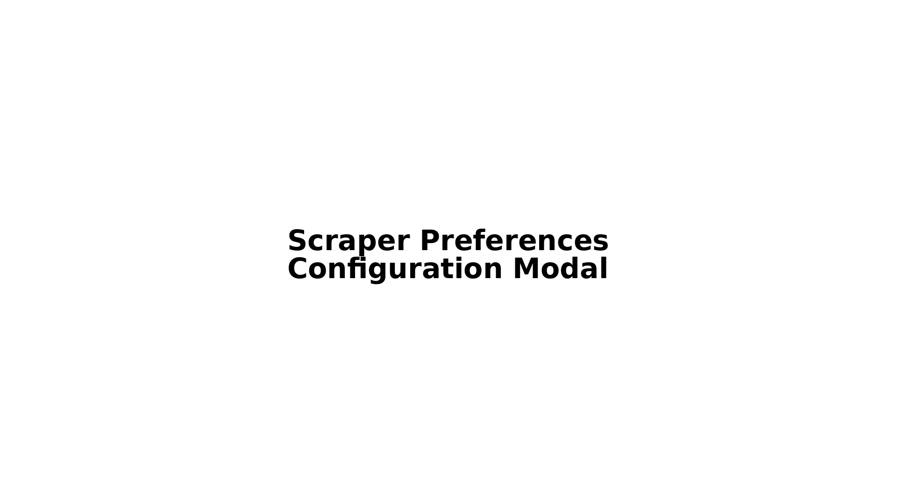
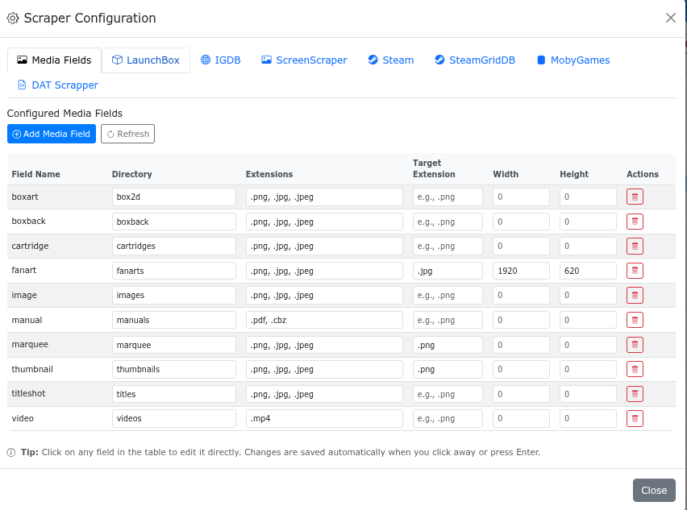

# GameManager - Complete Documentation


## Table of Contents

1. [Introduction](#introduction)
2. [Features Overview](#features-overview)
3. [Installation](#installation)
4. [Getting Started](#getting-started)
5. [User Interface](#user-interface)
6. [Core Features](#core-features)
7. [Scraping & Media Management](#scraping--media-management)
8. [Configuration](#configuration)
9. [Authentication & Security](#authentication--security)
10. [Advanced Features](#advanced-features)
11. [Deployment](#deployment)
12. [Troubleshooting](#troubleshooting)
13. [API Reference](#api-reference)
14. [Contributing](#contributing)

---

## Introduction

**GameManager** is a comprehensive, web-based game collection management system designed for organizing ROM collections with metadata, media files, and rich game information. Built with Flask and modern web technologies, it provides an intuitive interface for managing large game libraries across multiple platforms.


### Key Highlights

- 🎮 **Multi-Platform Support**: Works with various ROM systems (MAME, NES, GBA, Sega Genesis, PlayStation, and many more)
- 📊 **Rich Metadata**: Automatically scrape and manage game information from multiple sources
- 🖼️ **Media Management**: Comprehensive media file handling (box art, screenshots, videos, marquees, etc.)
- 🔄 **Real-Time Collaboration**: WebSocket-based real-time updates for multi-user environments
- 🌐 **Web-Based Interface**: Modern, responsive UI accessible from any device
- 🐳 **Docker Ready**: Easy deployment with Docker and Docker Compose
- 🔐 **Secure**: User authentication with Discord OAuth2 support

---

## Features Overview

### Core Capabilities

- **Game Collection Management**
  - View, edit, and organize games in an intuitive grid interface
  - Support for multiple ROM systems simultaneously
  - Quick search and filtering
  - Bulk operations on games

- **Media Management**
  - Automatic media file scanning and linking
  - Image and video preview with hover tooltips
  - Upload, delete, and rotate media files
  - Media field remapping and organization
  - 2D box art generation from multiple images
  - Video screenshot capture from current playback position

- **Metadata Scraping**
  - **LaunchBox Integration**: Import metadata and media from LaunchBox XML databases
  - **IGDB Integration**: Fetch game information, artwork, and videos from IGDB
  - **ScreenScraper**: Retro gaming metadata and media
  - **SteamGridDB**: Steam game grid artwork
  - **MobyGames**: Comprehensive game database
  - **YouTube**: Video download and integration
  - **Fanart.tv**: High-quality game artwork

- **Task Management**
  - Background task queue system
  - Real-time progress updates via WebSocket
  - Task history and logging
  - Cancellable long-running operations

- **User Management**
  - Multi-user support
  - Role-based access control
  - Discord OAuth2 authentication
  - User registration and validation


---

## Installation

### Prerequisites

- **Operating System**: Linux (Debian 13+, Ubuntu 25.04+) for deb install, or any distro docker install
- **Python**: 3.11 or higher
- **Web Browser**: Modern browser with JavaScript enabled


### Debian/Ubuntu Package Installation

```bash
# Download the .deb package
wget https://github.com/aderumier/emulationstation_gamemanager/releases/download/v2.9.3/gamemanager_2.9.3-1_all.deb

# Install
sudo dpkg -i gamemanager_2.9.3-1_all.deb

# Fix dependencies if needed
sudo apt-get install -f
```


### Docker

```bash
# Pull the latest image
docker pull aderumier/emulationstation_gamemanager:latest

# Run with Docker Compose
docker compose up -d

# Or run directly
docker run -d \
  --name gamemanager \
  -p 5000:5000 \
  -v $(pwd)/roms:/opt/gamemanager/roms \
  -v $(pwd)/var:/opt/gamemanager/var \
  aderumier/emulationstation_gamemanager:latest
```


### Manual Installation

For detailed installation instructions, see:
- [Docker Deployment Guide](DOCKER_DEPLOYMENT.md)
- [Debian Package Installation](INSTALL_DEB.md)
- [README.md](README.md) - Manual installation steps

---

## Getting Started

### First Launch

1. **Access the Web Interface**
   - Open your browser: `http://localhost:5000`
   - Default admin credentials:
     - Username: `admin`
     - Password: `admin123`
     - ⚠️ **Change immediately after first login!**


2. **Download the launchbox database && update the local scrappers databases**


3. **Configure Your ROM Directory**
   - Go to **Configuration → Application Config**
   - Set the ROMs root directory path
   - Configure other settings as needed


4. **Configure Your systems**
   - Go to **Configuration → System Configuration**
   - Add the game systems that you have in your roms directory
   


6. **Load a System**
   - Select a ROM system from the dropdown
   - The game list will automatically load from `roms/<system>/gamelist.xml`


---

## User Interface

### Main Components

#### 1. Navigation Bar


- **System Selector**: Choose the active ROM system


- **Configuration Menu**: Access all Application configuration options


- **Current System Menu**: System-specific operations


- **User Menu**: Account settings, User Automatic Scrappers preferences and logout


#### 2. Game Grid


The main game grid displays all games in the current system with columns for:
- **Name**: Game title (editable)
- **Path**: ROM file path
- **Description**: Game description
- **Genre, Developer, Publisher**: Metadata fields
- **Media Fields**: Thumbnails and preview icons
- **IDs**: LaunchBox, IGDB, Screenscraper, Steam, etc.
- **YouTube URL**: Video link

**Features**:
- Sortable columns
- Filterable/searchable
- Column visibility toggle
- Resizable columns
- Dark mode support
- Thumbnail grid view

#### 3. Media Preview Pane


Right-side panel showing:
- All media files for selected game
- Large preview images with hover tooltips
- Action buttons (rotate, delete, upload)
- Field labels and organization

#### 4. Task Management Panel


Bottom panel displaying:
- Active background tasks
- Task progress and status
- Task history
- Cancel buttons for running tasks

You can double click on a task to see the detailled task log. (Also in Live!)


---

## Core Features

### Game Management

#### Viewing Games

- **Grid View**: Default view with all columns


- **Thumbnail View**: Card-based view with large thumbnails


- **Toggle**: Use the view switcher in the toolbar



#### Editing Games

1. **Quick Edit**: Double-click a cell to edit inline
2. **Full Edit Modal**: Click the edit button or double-click the name column


**Edit Modal Tabs**:
- **Game Information**: Metadata fields, IDs, descriptions
- **Media Files**: View and manage all media files
- **Video Preview**: Preview and manage video files


#### Adding Games

Games are automatically added when:
- ROM files are placed in the system directory
- `gamelist.xml` is imported/refreshed

Manual addition:
1. Place ROM file in `roms/<system>/` directory
2. Click **"Force Import gamelist.xml"** from Current System menu
3. Game appears in the grid

#### Deleting Games

- **Single Game**: Right-click → Delete, or use the delete button
- **Multiple Games**: Select games (checkbox column) → Delete Selected
- Confirmation dialog appears before deletion


### Media Management

#### Media Types Supported

- **Images**: `image`, `marquee`, `titleshot`, `boxart`, `fanart`, `screenshot`
- **Videos**: `video`, `video_mp4`, `video_avi`, `video_mov`, `video_mkv`
- **Documents**: `manual`, `map`, `magazine` (PDF/CBZ files)
- **Other**: Custom media fields as configured

#### Media Preview and Image Management


The **Media Preview** pane displays all media files for the selected game. It provides a comprehensive interface for viewing, managing, and downloading media files.

**Media Preview Features**:

- **Thumbnail Grid**: All media files displayed as cards with thumbnails
- **Hover Tooltips**: Large preview images on hover
- **Field Labels**: Each media card shows the field name (e.g., `image`, `marquee`, `fanart`)
- **Action Buttons**: Quick access buttons under each media card for scraping and downloading
- **Context Menu**: Right-click on images for rotate and delete options
- **Double-Click Upload**: Double-click any media card to upload/replace files

**Image Management Operations**:

##### Uploading Media

1. Open **Edit Game Modal** → **Media Files** tab
2. Click **Upload** button for the desired media field, or
3. **Double-click** on any media card to upload/replace
4. Select file from your computer
5. File is automatically:
   - Saved to the correct media directory
   - Processed (converted/resized if configured)
   - Linked in `gamelist.xml`


##### Rotating Images

1. **Right-click** on an image in the media preview
2. Context menu appears
3. Select **Rotate Left** or **Rotate Right**
4. Image is rotated and saved atomically


**Note**: Rotation is applied immediately and saved to disk. The original file is replaced.

##### Deleting Media

- **Right-click** on a media item → Context menu → **Delete**
- Or select media and press **Delete** key
- Files are removed from disk and `gamelist.xml` is updated

**Scraping Buttons Under Images**:

Each image media card displays action buttons at the bottom for quick access to scraping and download features:

##### 1. Multiscraper Download


**Button**: Search icon (🔍) - Available on all image fields

**Purpose**: Search across all configured scrapers simultaneously to find media

**How to Use**:
1. Click the **Multiscraper Download** button (🔍) under any image media card
2. Modal opens showing results from all scrapers:
   - LaunchBox
   - IGDB
   - ScreenScraper
   - SteamGridDB
   - MobyGames
   - Fanart.tv
3. Browse available images with previews
4. Select desired images and click **Download**
5. Images are automatically processed and linked

**Features**:
- Multi-source search in one interface
- Preview before download
- Region and resolution information
- Automatic file processing


##### 2. LaunchBox Media Download


**Button**: Download icon (⬇️) - Available on all image fields

**Purpose**: Download media specifically from LaunchBox database

**How to Use**:
1. Click the **LaunchBox Download** button (⬇️) under any image media card
2. Select media types to download (box art, screenshots, etc.)
3. System searches LaunchBox database
4. Shows available media with previews
5. Select and download
6. Automatic processing and integration

**Features**:
- Direct LaunchBox database access
- Multiple media types available
- Region priority support
- High-quality scans


##### 3. Fanart Search


**Button**: Image icon (🖼️) - Available on `fanart` field only

**Purpose**: Search Fanart.tv for high-quality game artwork

**How to Use**:
1. Click the **Fanart Search** button (🖼️) under a `fanart` media card
2. Modal opens with Fanart.tv search results
3. Browse high-resolution artwork
4. Select and download desired images
5. Images are automatically processed and linked

**Features**:
- High-resolution images
- Multiple image types
- Region and resolution information
- Professional game artwork


##### 4. Google Images Search


**Button**: Google icon (🔍) - Available on `fanart` field only

**Purpose**: Search Google Images for game artwork and fan art

**How to Use**:
1. Click the **Google Images Search** button (🔍) under a `fanart` media card
2. Google Images Search modal opens
3. Game name is pre-filled (editable)
4. Select **Aspect Ratio** filter (optional):
   - **Panoramic** (default): Wide landscape images
   - **Wide**: Landscape format
   - **Portrait**: Vertical images
   - **Square**: Square format
   - **Any**: No filter
5. Click **Search** or use **"Open in Tab"** to search in new browser tab
6. Browse search results with thumbnails
7. Click on any image to download it
8. Image is automatically downloaded and linked to the game

**Features**:
- Direct Google Images integration
- Aspect ratio filtering
- Large selection of images
- Full-size image download
- Open search in new tab option
- Direct URL download support

**Aspect Ratio Options**:
- **Panoramic**: Best for fan art backgrounds (wide format)
- **Wide**: Standard landscape images
- **Portrait**: Vertical artwork
- **Square**: Square format images
- **Any**: All aspect ratios

**Tips**:
- Use aspect ratio filters to find images matching your needs
- Panoramic is ideal for fan art backgrounds
- You can edit the search query to refine results
- Use "Open in Tab" for advanced Google Images features
- Direct URL download is available for specific image URLs


##### 5. Marquee Search


**Button**: Badge icon (🏷️) - Available on `marquee` field only

**Purpose**: Find and download arcade marquee images

**How to Use**:
1. Click the **Marquee Search** button (🏷️) under a `marquee` media card
2. Modal opens with marquee search results
3. Browse available marquee images
4. Select and download
5. Images are automatically processed and linked

**Features**:
- Specialized for arcade games
- Multiple sources
- Region selection
- High-quality marquee scans


**Button Summary**:

| Button | Icon | Field | Purpose |
|--------|------|-------|---------|
| Multiscraper Download | 🔍 | All image fields | Search all scrapers |
| LaunchBox Download | ⬇️ | All image fields | Download from LaunchBox |
| Fanart Search | 🖼️ | `fanart` only | Search Fanart.tv |
| Google Images Search | 🔍 | `fanart` only | Search Google Images |
| Marquee Search | 🏷️ | `marquee` only | Search marquee images |

#### Taking Screenshots from Videos

1. Open **Edit Game Modal** → **Video Preview** tab
2. Play the video and navigate to desired frame
3. Click **"Take Screenshot"** button
4. Preview modal appears with captured screenshot
5. Select target field (image or titleshot)
6. Click **Validate** to save


**Note**: Screenshot feature captures the current video frame using HTML5 Canvas API.

#### Manual Video Cropping

Manual video cropping allows you to remove black borders or unwanted areas from game videos by visually selecting the crop area on a video frame.


**How to Use Manual Video Cropping:**

1. **Open Edit Game Modal** → **Video Preview** tab
2. Ensure the game has a video file (supports: `video`, `video_mp4`, `video_avi`, `video_mov`, `video_mkv`)
3. Click the **"Manual Crop"** button (enabled when a video is present)
4. The **Manual Video Cropping** modal opens:
   - **Left Panel**: Shows a preview frame extracted from the middle of the video
   - **Right Panel**: Crop settings and controls
5. **Select Crop Area**:
   - Click and drag on the preview image to select the area you want to keep
   - The crop area is displayed with a selection rectangle
   - Use the **"Keep Aspect Ratio"** checkbox to maintain proportions
6. **Adjust Crop Settings**:
   - View real-time crop dimensions and position in the info panel
   - Click **"Reset Crop"** to clear the selection and start over
7. **Apply Crop**:
   - Click **"Apply Crop"** to process the video
   - The system will:
     - Extract the selected crop area from the entire video
     - Create a new cropped video file
     - Replace the original video with the cropped version
     - Update the `gamelist.xml` file with the new video path

**Technical Details:**

- **Frame Extraction**: The system extracts a frame from the middle of the video to use as a preview
- **Crop Format**: Crop dimensions are specified as `width:height:x:y` (e.g., `1920:1080:0:0`)
- **Video Processing**: Uses FFmpeg to apply the crop filter to the entire video
- **File Replacement**: The original video is replaced with the cropped version
- **Supported Formats**: Works with MP4, AVI, MOV, MKV, and other FFmpeg-supported video formats

**Tips:**

- Extract a representative frame from the middle of the video for accurate cropping
- Use "Keep Aspect Ratio" to maintain proper video proportions
- The crop area can be adjusted by dragging the corners or edges of the selection rectangle
- The preview frame is automatically cleaned up after closing the modal

**Note**: Manual cropping processes the entire video, not just a single frame. The crop area you select is applied to all frames of the video.

#### Deleting Media

- **Single Media**: Click media item → Context menu → Delete
- **Multiple Media**: Select items → **Delete Selected Media** button
- Files are removed from disk and `gamelist.xml` is updated

#### PDF and CBZ Viewer



The PDF/CBZ viewer allows you to view game manuals, maps, magazines, and other document files directly in your browser without downloading them.

**Supported File Types**:
- **PDF Files**: Standard PDF documents (`.pdf`)
- **CBZ Files**: Comic Book ZIP archives (`.cbz`) - commonly used for scanned manuals and documents

**Supported Media Fields**:
- **manual**: Game manuals and instruction booklets
- **map**: Game maps and guides
- **magazine**: Gaming magazines and publications
- Any custom media field containing PDF or CBZ files

**How to Use the PDF/CBZ Viewer**:

1. **Access from Media Preview**:
   - Open **Edit Game Modal** → **Media Files** tab
   - Find a media item with a PDF or CBZ file (shows PDF icon)
   - Click the **PDF Viewer** button (📄 icon) on the media card
   - The PDF/CBZ viewer modal opens

2. **Viewing Documents**:
   - The viewer opens in a full-screen modal
   - PDF files use the EmbedPDF viewer with:
     - Page navigation controls
     - Zoom in/out functionality
     - Full-screen viewing
     - Search capabilities
   - CBZ files use a custom viewer with:
     - Page-by-page navigation
     - Image viewing for each page
     - Zoom controls

3. **Navigation**:
   - Use the viewer's built-in controls to navigate pages
   - Zoom in/out using mouse wheel or controls
   - Close the viewer by clicking the **Close** button or pressing Escape

**Features**:

- **EmbedPDF Integration**: Uses EmbedPDF library for high-quality PDF rendering
- **CBZ Support**: Full support for CBZ (Comic Book ZIP) archives
- **Automatic Detection**: Automatically detects PDF/CBZ files in supported media fields
- **Preview Thumbnails**: Shows preview thumbnails in media cards before opening
- **Full-Screen Viewing**: Large modal for comfortable document reading
- **No Download Required**: View documents directly in browser
- **CORS Support**: Properly configured API endpoints for secure file access

**Technical Details**:

- **PDF Viewer**: Uses [EmbedPDF](https://www.embedpdf.com/) library
  - Loaded dynamically from CDN
  - Supports Web Workers for performance
  - Handles large PDF files efficiently
  - Provides standard PDF viewing controls

- **CBZ Viewer**: Uses JSZip library
  - Extracts CBZ archives on-the-fly
  - Displays images page by page
  - Supports navigation between pages
  - Handles image formats (PNG, JPG, etc.)

- **File Access**: 
  - Files are served through secure API endpoints
  - Paths are properly encoded for special characters
  - Supports relative paths from gamelist.xml
  - Validates file existence before loading

**Use Cases**:

- Viewing game manuals and instruction booklets
- Reading game maps and strategy guides
- Browsing gaming magazines
- Accessing scanned documentation
- Reviewing game-related PDF documents

**Tips**:

- PDF files work best with standard PDF format
- CBZ files should contain image files (PNG, JPG) for best results
- Large files may take a moment to load
- Use zoom controls for better readability
- The viewer automatically handles file path encoding

**Note**: The PDF/CBZ viewer requires an active internet connection for loading the EmbedPDF library. CBZ files are processed client-side using JSZip.

### Current System Menu Operations

The **Current System** menu provides system-specific operations for managing games and media files. Access it from the navigation bar.


#### 1. Remap Media Field


**Purpose**: Reorganize media files by moving them from one media field to another. This is useful when you want to change how media is categorized (e.g., moving all `boxart` files to `image` field).

**How to Use**:
1. Go to **Current System → Remap Media Field**
2. Select **Source Media Field**: The field you want to move files from
3. Select **Target Media Field**: The field you want to move files to
4. Click **"Remap Media Fields"** to start the process
5. Task runs in background with real-time progress updates

**What It Does**:
- Moves all media files from source field directory to target field directory
- Updates all `gamelist.xml` entries to reference the new field
- Preserves file names and structure
- Source field entries are removed after remapping

**Use Cases**:
- Reorganizing media categorization
- Consolidating similar media types
- Fixing incorrectly categorized media
- Standardizing media field usage across collection

**Note**: This operation affects all games in the current system. The source media field will be empty after remapping.

#### 2. Move Medias


**Purpose**: Move media files from their current location to the proper media directory based on the selected media field configuration. This ensures files are organized according to your media field settings.

**How to Use**:
1. Go to **Current System → Move Medias**
2. Select **Target Media Field**: The media field to move files to
3. Click **"Move Medias"** to start the process
4. Task runs in background with progress updates

**What It Does**:
- Scans all games in the current system
- Finds media files that are not in the correct directory
- Moves files to the proper directory based on media field configuration
- Updates `gamelist.xml` with new file paths
- Preserves files, only updates references

**Use Cases**:
- Organizing media files after configuration changes
- Fixing media files in wrong directories
- Standardizing media file organization
- Moving files to match new media field structure

**Note**: Files are moved, not copied. Original file locations are updated in `gamelist.xml`.

#### 3. Resize Medias



**Purpose**: Batch resize all images for a specific media field to configured dimensions. This ensures uniform image sizes across your collection.

**How to Use**:
1. Go to **Current System → Resize Medias**
2. Select **Media Field**: The media field to resize (e.g., `image`, `boxart`, `screenshot`)
3. Click **"Resize Medias"** to start the process
4. Task runs in background with progress updates

**What It Does**:
- Processes all images in the selected media field
- Resizes images to dimensions configured in Media Fields Configuration
- Maintains aspect ratio during resizing
- Uses ImageMagick for fast and high-quality image processing
- Updates files in place (original files are replaced)

**Requirements**:
- Media field must have width/height configured in **Configuration → Application Configuration → Media Fields**
- Only applies to image fields (not videos)
- Requires ImageMagick to be installed

**Use Cases**:
- Standardizing image sizes across collection
- Reducing file sizes for storage optimization
- Ensuring consistent image dimensions
- Applying new size requirements to existing media

**Note**: Original images are replaced. Make backups if you want to preserve originals.

#### 4. Import Medias



**Purpose**: Import media files from a source directory into your game collection's media folders. Useful for bulk importing media files collected separately.

**How to Use**:
1. Place media files in `roms/<system>/media/import/<source_directory>/`
2. Go to **Current System → Import Medias**
3. Select **Source Directory**: Choose from available subdirectories in the import folder
4. Select **Target Media Field**: Choose which gamelist media field to populate
5. (Optional) Check **"Overwrite existing media"** to replace existing files
6. Click **"Import Medias"** to start the process
7. Task runs in background with progress updates

**Matching Algorithm**:
The system uses a 4-level matching algorithm to link media files to games:

1. **Exact Filename Match**: Media filename (without extension) = ROM filename (without extension)
2. **Game Name Match**: Media filename (without extension) = Game name (case-insensitive)
3. **Normalized with Parentheses**: Both names normalized with parentheses preserved
4. **Normalized without Parentheses**: Both names normalized with parentheses removed

**What It Does**:
- Scans source directory for media files
- Matches files to games using the 4-level algorithm
- Renames files to match ROM filename + original extension
- Moves files from source directory to appropriate media directory
- Updates `gamelist.xml` with new media paths
- Respects overwrite setting for existing media

**File Structure**:
```
roms/<system>/media/import/
  ├── folder1/
  │   ├── game1.png
  │   └── game2.jpg
  └── folder2/
      └── game3.png
```

**Use Cases**:
- Bulk importing media from external sources
- Importing media from other emulation frontends
- Adding media collected manually
- Migrating media from old collections

**Tips**:
- Organize files in subdirectories for easier management
- Use descriptive folder names for different media batches
- Check overwrite option carefully to avoid losing existing media
- The system automatically matches files to games by name

#### 5. Clean Missing Media Fields


**Purpose**: Scan all games for missing media files and remove broken references from `gamelist.xml`. This cleans up your gamelist by removing references to files that no longer exist.

**How to Use**:
1. Go to **Current System → Clean Missing Media Fields**
2. Select **Media Field**: 
   - Choose a specific media field to clean (e.g., `image`, `marquee`)
   - Or select **"Any Field"** to clean all media fields
3. Click **"Clean Missing Media Fields"** to start
4. System scans all games and removes broken references
5. Progress is shown in real-time

**What It Does**:
- Scans all games in the current system
- Checks if media files referenced in `gamelist.xml` actually exist
- Removes media field entries for missing files
- Updates `gamelist.xml` to remove broken references
- Preserves valid media references

**Use Cases**:
- Cleaning up after manual file deletions
- Removing references to moved or deleted files
- Fixing broken media links
- Maintaining clean gamelist.xml files
- Recovering from file system issues

**Note**: This only removes references from `gamelist.xml`. It does not delete any files. Files that exist but aren't referenced won't be affected.

#### 6. Force Import Gamelist.xml



**Purpose**: Force a refresh of the game list by re-reading the `gamelist.xml` file from disk. This is useful when you've manually added ROM files or modified the gamelist.xml file outside the application.

**How to Use**:
1. Ensure ROM files are in `roms/<system>/` directory
2. (Optional) Manually edit `roms/<system>/gamelist.xml` if needed
3. Go to **Current System → Force Import Gamelist.xml**
4. System reloads the gamelist from disk
5. Game grid updates with current gamelist contents

**What It Does**:
- Reads `gamelist.xml` from `roms/<system>/gamelist.xml`
- Parses all game entries
- Updates the game grid with current data
- Detects new games added to the file
- Reflects any manual changes made to gamelist.xml

**Use Cases**:
- Adding games manually by editing gamelist.xml
- Refreshing after external tools modify gamelist.xml
- Recovering from application crashes
- Syncing with gamelist.xml changes made outside the app
- Importing games from backup gamelist.xml files

**Note**: This operation reads from disk and may overwrite any unsaved changes in memory. Make sure to save your work before forcing import.

---

## Scraping & Media Management

### Available Scrapers

#### 1. LaunchBox


**Capabilities**:
- Import metadata from LaunchBox XML databases
- Download media files (box art, screenshots, videos, etc.)
- Automatic platform matching
- Region priority support

**Setup**:
1. Download LaunchBox Metadata.xml
2. Place in `var/db/launchbox/Metadata.xml`
3. Configure in **Configuration → Cache Management**

#### 2. IGDB


**Capabilities**:
- Comprehensive game database
- High-quality artwork (covers, screenshots, artworks, logos)
- Video downloads
- Company and genre information


#### 3. ScreenScraper


**Capabilities**:
- Retro gaming focus
- Regional media variants
- High-resolution scans
- Manual scrap with region selection

**Setup**:
- Configure credentials in **Configuration → Application Configuration → Authentication** (for Discord) or **Configuration → Scraper Configuration** (for scraper-specific credentials)
- Free tier available with rate limiting

#### 4. SteamGridDB


**Capabilities**:
- Steam game grid artwork
- Logos and hero images
- Community-submitted content

#### 5. MobyGames


**Capabilities**:
- Extensive game database
- Historical game information
- Screenshots and box art

#### 6. Steam


**Capabilities**:
- Steam game database matching
- Steam app metadata and information
- Game matching via Steam App ID
- Steam API integration for app discovery
- Find best match functionality for Steam games

**Setup**:
1. Steam integration uses the public Steam API (no authentication required)
2. The system automatically downloads and caches the Steam app list
3. Steam app index is cached locally in `var/db/steam/appindex.json`
4. Cache is automatically refreshed every 24 hours

**How It Works**:
- **App Index**: Downloads complete Steam app database from Steam API
- **Game Matching**: Matches ROM names against Steam app names
- **Normalization**: Removes parentheses and special characters for better matching
- **Exact Matching**: Prioritizes exact matches for fast results
- **Find Best Match**: Available in Find Best Match dropdown for bulk matching

**Use Cases**:
- Matching PC games and Steam releases
- Finding Steam App IDs for games
- Validating game names against Steam database
- Bulk matching multiple games against Steam catalog

**Note**: Steam integration is primarily for game matching and identification. For Steam-specific artwork, use SteamGridDB integration.

#### 7. DAT Scrapper


**Capabilities**:
- DAT file-based game matching
- ROM set validation and identification
- Exact ROM filename matching
- Case-insensitive matching support
- Find best match functionality for DAT files

**Setup**:
1. Place DAT files in the configured DAT directory
2. Configure DAT file mapping in **Configuration → Systems Configuration**
3. Map each system to its corresponding DAT file
4. DAT files are automatically loaded when needed

**How It Works**:
- **DAT File Loading**: Loads DAT files configured for each system
- **ROM Name Matching**: Matches ROM filenames (without extension) against DAT entries
- **Direct Matching**: First tries exact filename match
- **Case-Insensitive**: Falls back to case-insensitive matching if needed
- **Find Best Match**: Available in Find Best Match dropdown for bulk matching

**DAT File Format**:
- Supports standard DAT file formats (No-Intro, Redump, etc.)
- Each DAT entry contains game name and ROM filename
- System-specific DAT files for accurate matching

**Use Cases**:
- Validating ROM sets against official DAT files
- Identifying unknown ROM files
- Matching ROM filenames to proper game names
- ROM collection organization and verification
- Bulk identification of ROM files

**Configuration**:
- Go to **Configuration → Systems Configuration**
- Select a system
- Choose the corresponding DAT file from the dropdown
- Save configuration

**Note**: DAT Scrapper is essential for ROM set validation and ensuring your collection matches official DAT file specifications.

#### 8. YouTube Integration


**Capabilities**:
- Video search and preview
- Download 30-second clips
- Automatic cropping (black border removal)
- Manual time selection
- PO Token provider support for restricted videos

**Setup**:
- Configure YouTube cookies (optional)
- Set up PO Token provider (optional, for restricted videos)
- See video configuration in **Configuration → Video Configuration**

### Manual Scraping


1. Select a game
2. Click **"Manual Scrap"** button
3. Search for the game across all scrapers
4. View results with previews
5. Select desired media and download
6. Media is automatically processed and linked

**Features**:
- Multi-scraper search
- Region selection
- Resolution display
- Preview before download

### Automatic Scraping

Automatic scraping allows you to quickly scrape metadata and media for selected games using dedicated scraper buttons in the main interface toolbar. Each scraper has its own preferences modal where you can configure what fields to scrape and how to handle existing data.

#### Main Interface Scraper Buttons



The main interface toolbar contains scraper buttons that become enabled when games are selected. These buttons allow you to automatically scrape metadata and media for multiple games at once.

**Available Scraper Buttons**:

1. **LaunchBox** (🔵 Blue button)
   - Scrapes metadata and media from LaunchBox XML database
   - Requires LaunchBox Metadata.xml file
   - Platform-specific matching

2. **IGDB** (🔵 Info button)
   - Scrapes game information, artwork, and videos from IGDB
   - Requires IGDB platform configuration
   - High-quality modern game database

3. **Steam** (🟢 Green button)
   - Scrapes Steam game metadata and media
   - Uses Steam API for app discovery
   - Useful for PC games and Steam releases

4. **SteamGridDB** (🟡 Warning button)
   - Scrapes Steam game grid artwork
   - Community-submitted content
   - Logos and hero images

5. **ScreenScraper** (🟡 Warning button)
   - Scrapes retro gaming metadata and media
   - Regional media variants
   - High-resolution scans

6. **MobyGames** (⚫ Secondary button)
   - Scrapes extensive game database
   - Historical game information
   - Screenshots and box art

7. **DAT Scrapper** (⚫ Dark button)
   - Validates ROM sets against DAT files
   - ROM identification and matching
   - DAT file-based operations

**How to Use Automatic Scraping**:

1. **Select Games**:
   - Select one or more games from the game grid
   - Use checkboxes or Ctrl/Cmd+Click for multiple selection
   - Scraper buttons become enabled when games are selected

2. **Configure Scraper Preferences** (Optional):
   - Go to **User Menu → Scrap Preferences**
   - Select the scraper you want to configure (e.g., "Launchbox Scrap Preferences")
   - Configure:
     - **Field Selection**: Choose which fields to scrape (text fields, media fields)
     - **Overwrite Options**: Control whether to overwrite existing data
     - **Force Download**: Download media even if fields are not empty
   - Preferences are saved per user and persist across sessions

3. **Click Scraper Button**:
   - Click the desired scraper button (e.g., "Launchbox", "IGDB")
   - A confirmation modal may appear showing scraping options
   - Confirm to start the scraping task

4. **Monitor Progress**:
   - Task appears in the Task Management panel
   - Real-time progress updates via WebSocket
   - View detailed logs by double-clicking the task

5. **Results**:
   - Metadata and media are automatically downloaded and linked
   - Games are updated in the grid
   - Media files appear in media preview

**Scraper Preferences Modals**:

Each scraper has a dedicated preferences modal accessible from **User Menu → Scrap Preferences**. These modals allow you to configure:

- **Field Selection**: 
  - Choose which text fields to scrape (name, description, developer, etc.)
  - Choose which media fields to download (images, videos, etc.)
  - Checkboxes for each available field

- **Overwrite Options**:
  - **Overwrite Text Fields**: Replace existing text metadata
  - **Overwrite Media Fields**: Replace existing media files
  - **Force Download**: Download media even if fields already have content

- **Scraper-Specific Options**:
  - LaunchBox: Force download, overwrite text fields
  - IGDB: Overwrite text/media fields, field selection
  - ScreenScraper: Region preferences, media type selection
  - Steam: Media type selection
  - SteamGridDB: Media type selection
  - MobyGames: Field selection
  - DAT Scrapper: DAT file operations

**Preferences Persistence**:
- Preferences are saved per user
- Settings persist across browser sessions
- Each scraper has independent preferences
- Preferences apply to all automatic scraping operations

**Tips**:
- Configure preferences before bulk scraping to avoid unwanted overwrites
- Use "Force Download" to refresh media even if it exists
- Select specific fields to scrape only what you need
- Check overwrite options carefully to preserve existing data
- Preferences are user-specific, so each user can have their own settings

#### Find Best Match


**Purpose**: Automatically find and match games with metadata sources using intelligent similarity matching algorithms. This feature helps you quickly identify and link your ROM files with accurate metadata from various databases.

**How to Use Find Best Match:**

#### From Main Interface (Bulk Matching)

1. **Select Games**: 
   - Select one or more games from the game grid (use checkboxes or Ctrl/Cmd+Click)
   - The **"Find Best Match"** button becomes enabled when games are selected

2. **Choose Scraper Source**:
   - Click the **"Find Best Match"** dropdown button
   - Select the scraper source:
     - **LaunchBox**: Match against LaunchBox metadata database
     - **MobyGames**: Match against MobyGames database
     - **DAT Scrapper**: Match against DAT file entries
     - **Steam**: Match against Steam game database
     - **IGDB**: Match against IGDB database

3. **Review Matches**:
   - A modal opens showing match results for each selected game
   - Each game displays:
     - **Original Name**: Your ROM file name
     - **Matched Name**: The best match found in the database
     - **Similarity Score**: Confidence level (0-100%)
     - **Database ID**: Unique identifier for the matched entry
     - **Preview**: Thumbnail or metadata preview if available

4. **Apply Matches**:
   - Review each match and adjust if needed
   - Click **"Apply Selected Matches"** to update all games
   - Or click individual **"Apply"** buttons for specific games
   - Metadata and media links are automatically updated

#### From Game Edit Modal (Single Game)

1. **Open Edit Game Modal**: Click on a game to edit
2. **Click "Find Best Match"**: Button located in the game edit modal
3. **Select Algorithm** (optional): Choose similarity algorithm from dropdown
4. **Review Matches**: Modal shows top matches with similarity scores
5. **Select Match**: Click on the desired match to apply it
6. **Save Changes**: Metadata is updated immediately

**Supported Scrapers:**

- **LaunchBox**: Comprehensive metadata from LaunchBox XML databases
  - Requires LaunchBox Metadata.xml file
  - Matches by game name and alternate names
  - Platform-specific matching based on system configuration

- **MobyGames**: Extensive historical game database
  - System-specific matching (uses configured MobyGames platform)
  - High-quality metadata and game information
  - Supports alternate names and variations

- **DAT Scrapper**: DAT file-based matching
  - Matches against configured DAT files
  - Useful for ROM set validation and identification

- **Steam**: Steam game database matching
  - Matches against Steam app database
  - Useful for PC games and Steam releases

- **IGDB**: IGDB database matching
  - Requires IGDB platform configuration
  - Comprehensive modern game database
  - High-quality metadata and artwork

**Similarity Algorithms:**

The system uses string similarity algorithms to find the best matches. You can select which algorithm to use:

- **Jaro-Winkler** (default): Best for names with common prefixes
  - Weighted towards strings that share a common prefix
  - Good for detecting typos and variations
  - Recommended for most use cases

- **Damerau-Levenshtein**: Accounts for transpositions
  - Considers character swaps (e.g., "ab" vs "ba")
  - Good for detecting common typos

- **Levenshtein**: Classic edit distance algorithm
  - Measures minimum edits needed to transform one string to another
  - Good general-purpose matching

- **Jaro**: Similarity based on matching characters
  - Considers character order and position
  - Good for names with similar structure

- **Hamming**: Distance between strings of equal length
  - Only works for strings of the same length
  - Fast but limited use case

**Features:**

- **Bulk Processing**: Match multiple games simultaneously
- **Preview Before Apply**: Review all matches before committing changes
- **Similarity Scoring**: See confidence levels for each match
- **Alternate Name Matching**: Finds matches even with different naming conventions
- **Platform-Specific**: Only searches within the configured platform/system
- **Real-Time Preview**: See metadata previews before applying
- **Manual Override**: Edit game name manually if automatic matching fails

**Tips:**

- Use **Jaro-Winkler** algorithm for best results with most game names
- Select multiple games for bulk matching to save time
- Review similarity scores - matches above 80% are usually reliable
- Check alternate names if the primary match doesn't look right
- Use platform-specific scrapers (MobyGames, IGDB) for more accurate results
- The system normalizes game names (removes special characters, articles) for better matching

#### 2D Box Generator


The 2D Box Generator creates box art images by combining multiple source images (front, back, spine) into a single 2D box art image.

**How to Use**:

1. **Access 2D Box Generator**:
   - Go to **Configuration → 2D Box Generator Configuration**
   - Or access from game edit modal for individual games

2. **Configure Template**:
   - Set box art dimensions (width, height)
   - Configure layout and positioning
   - Customize template structure

3. **Select Source Images**:
   - Choose front cover image
   - Choose back cover image (optional)
   - Choose spine image (optional)

4. **Generate Box Art**:
   - Click **"Generate"** to create the 2D box art
   - Preview the result
   - Save to the appropriate media field

**Features**:
- Combine multiple images into single box art
- Customizable dimensions and layout
- Template customization
- Image positioning controls
- Automatic aspect ratio handling

**Configuration**:
- Set default dimensions in **Configuration → 2D Box Generator Configuration**
- Configure image positioning
- Set template preferences
- Customize layout structure

**Use Cases**:
- Creating 2D box art from 3D box scans
- Combining front/back/spine images
- Generating custom box art layouts
- Standardizing box art dimensions

#### Scraper Preferences Configuration



Each scraper has a dedicated preferences modal that allows you to configure what data to scrape and how to handle existing information.

**Accessing Preferences**:
- Go to **User Menu → Scrap Preferences**
- Select the scraper you want to configure:
  - Launchbox Scrap Preferences
  - ScreenScraper Scrap Preferences
  - IGDB Scrap Preferences
  - Steam Scrap Preferences
  - SteamGridDB Scrap Preferences
  - MobyGames Scrap Preferences
  - DAT Scrapper Scrap Preferences

**Common Preferences Options**:

1. **Scraping Options**:
   - **Force Download**: Download media even if fields are not empty
   - **Overwrite Text Fields**: Replace existing text metadata
   - **Overwrite Media Fields**: Replace existing media files

2. **Field Selection**:
   - **Text Fields**: Choose which metadata fields to scrape
     - Name, Description, Developer, Publisher, Genre, etc.
   - **Media Fields**: Choose which media types to download
     - Images, Videos, Manuals, etc.

3. **Scraper-Specific Options**:
   - **LaunchBox**: Field mapping, region priority
   - **IGDB**: Media type selection, artwork types
   - **ScreenScraper**: Region selection, media type preferences
   - **Steam**: Media type selection
   - **SteamGridDB**: Grid type selection
   - **MobyGames**: Field selection
   - **DAT Scrapper**: DAT file operations

**Saving Preferences**:
- Click **"Save Preferences"** to store settings
- Preferences are saved per user
- Settings apply to all automatic scraping operations
- Preferences persist across browser sessions

**Tips**:
- Configure preferences before bulk scraping
- Use field selection to scrape only needed data
- Enable overwrite options carefully to preserve existing data
- Each scraper has independent preferences
- Preferences are user-specific

### YouTube Video Download


**Features**:
- Preview video in embedded player
- Select start time for 30-second clip
- Automatic black border detection and cropping
- Batch download support
- Cookie support for restricted videos
- PO Token provider for age-restricted content

**Workflow**:
1. Enter YouTube URL in game edit modal
2. Click **"YouTube Search"** or preview button
3. Preview video and select start time
4. Enable auto-crop if needed
5. Download clip
6. Video is processed and linked to game

---

## Configuration

### Application Configuration


The Application Configuration modal contains three tabs:

#### Settings Tab

**Settings**:
- ROMs root directory
- Server host and port
- Debug mode
- Task management (max tasks to keep)

#### Authentication Tab

**Discord Configuration**:
- Client ID
- Client Secret
- Redirect URI
- Bot Token
- Auto-create users settings
- Guild ID and Role Name

**Authentication Settings**:
- Disable Local Authentication option

#### Media Fields Tab

See [Media Fields Configuration](#media-fields-configuration) section below for details.

### System Configuration


**Features**:
- Add/edit ROM systems
- Map to LaunchBox platforms
- Configure media field mappings
- Set system-specific settings

### Scraper Configuration


**Configure**:
- LaunchBox settings and image type mappings
- IGDB settings and image type mappings
- ScreenScraper credentials and image type mappings
- Steam image type mappings
- SteamGridDB credentials and image type mappings
- MobyGames field mappings
- DAT Scrapper field mappings
- Rate limiting
- Region priorities

**Note**: Media Fields configuration has been moved to **Application Configuration → Media Fields** tab.

#### Media Fields Configuration



The Media Fields tab is located in the Application Configuration modal. It allows you to define and configure all media fields used in your game collection.

**What are Media Fields?**

Media fields are categories for different types of media files (images, videos, documents) associated with games. Each media field defines:
- Where files are stored (directory)
- What file types are accepted (extensions)
- How files are processed (conversion and resizing)

**Configuring Media Fields:**

1. **Access Media Fields Configuration**:
   - Go to **Configuration → Application Configuration**
   - Click on the **"Media Fields"** tab (third tab)

2. **View Existing Media Fields**:
   - The table displays all configured media fields
   - Columns show:
     - **Field Name**: The media field identifier (e.g., `image`, `marquee`, `boxart`)
     - **Directory**: Subdirectory name where files are stored (e.g., `images`, `marquees`, `boxart`)
     - **Extensions**: Allowed file extensions (e.g., `png,jpg,jpeg`)
     - **Target Extension**: Format to convert files to (optional, e.g., `png`)
     - **Width**: Target width for resizing (optional, 0 = no resize)
     - **Height**: Target height for resizing (optional, 0 = no resize)

3. **Add a New Media Field**:
   - Click **"Add Media Field"** button
   - Enter the field configuration:
     - **Field Name**: Unique identifier (e.g., `custom_artwork`)
     - **Directory**: Directory name (e.g., `custom-artwork`)
     - **Extensions**: Comma-separated list (e.g., `png,jpg,jpeg`)
     - **Target Extension**: Optional conversion format
     - **Width/Height**: Optional resize dimensions
   - Changes are saved automatically

4. **Edit Existing Media Fields**:
   - Click directly on any cell in the table to edit
   - Changes are saved automatically when you:
     - Click away from the cell
     - Press Enter
   - Use **"Refresh"** button to reload configuration

5. **Delete Media Fields**:
   - Click the delete button (trash icon) in the Actions column
   - Confirm deletion
   - **Note**: Deleting a media field does not delete the files, only the configuration

**Media Field Properties:**

- **Field Name**: 
  - Must be unique
  - Used in `gamelist.xml` as the field identifier
  - Examples: `image`, `marquee`, `titleshot`, `boxart`, `fanart`, `screenshot`, `video`

- **Directory**:
  - Subdirectory name within `roms/<system>/media/`
  - Files are stored at: `roms/<system>/media/<directory>/<filename>`
  - Examples: `images`, `marquees`, `titleshots`, `boxart`, `fanart`, `screenshots`, `videos`

- **Extensions**:
  - Comma-separated list of allowed file extensions
  - Case-insensitive
  - Examples: `png,jpg,jpeg` or `mp4,avi,mkv`

- **Target Extension** (Optional):
  - Format to convert files to during processing
  - If specified, uploaded/downloaded files are automatically converted
  - Common values: `png`, `jpg`, `webp`
  - Leave empty to keep original format

- **Width/Height** (Optional):
  - Target dimensions for image resizing
  - Set to `0` to disable resizing for that dimension
  - If both are set, images are resized maintaining aspect ratio
  - Only applies to image fields (not videos)
  - Examples: `1920x1080`, `256x256`, `0x0` (no resize)

**How Media Fields Work:**

1. **File Storage**:
   - When a file is uploaded or downloaded for a media field, it's saved to:
     `roms/<system>/media/<directory>/<filename>`
   - The path is stored in `gamelist.xml` as: `./media/<directory>/<filename>`

2. **Automatic Processing**:
   - If **Target Extension** is set, files are converted to that format
   - If **Width/Height** are set, images are resized to those dimensions
   - Processing happens automatically during:
     - File uploads
     - Media downloads from scrapers
     - Media operations (resize, convert)

3. **Scraper Mappings**:
   - Each scraper (LaunchBox, IGDB, ScreenScraper, etc.) has its own image types
   - Media field mappings determine which scraper image types map to which media fields
   - Configure mappings in other tabs (LaunchBox, IGDB, ScreenScraper, etc.)

**Default Media Fields:**

Common media fields included by default:
- **image**: Game thumbnail/icon (`images/`, `png,jpg,jpeg`)
- **marquee**: Arcade marquee artwork (`marquees/`, `png,jpg,jpeg`)
- **titleshot**: Title screen screenshot (`titleshots/`, `png,jpg,jpeg`)
- **boxart**: Box art image (`boxart/`, `png,jpg,jpeg`)
- **fanart**: Fan art/background (`fanart/`, `png,jpg,jpeg`)
- **screenshot**: In-game screenshot (`screenshots/`, `png,jpg,jpeg`)
- **video**: Gameplay video (`videos/`, `mp4,avi,mkv,mov`)

**Tips:**

- Use descriptive field names that match your collection organization
- Set target extensions for consistency (e.g., convert all images to PNG)
- Configure width/height for uniform image sizes
- Keep extensions list comprehensive to accept various file formats
- Directory names should be lowercase and use hyphens or underscores
- Media fields are system-wide - they apply to all systems
- Changes take effect immediately for new uploads/downloads

### Video Configuration


**Settings**:
- Force video resolution
- YouTube API key
- YouTube cookies (for restricted videos)
- PO Token provider (for age-restricted content)
- Auto-crop settings
- Cookie skip duration threshold

### GUI Preferences


**Options**:
- **Dark Mode**: Toggle dark/light theme
- **Media Card Background Color**: Customize media preview background
- **Column Visibility**: Show/hide grid columns
- **Similarity Algorithm**: Choose matching algorithm

**Dark Mode**:
- Fully themed interface
- AG Grid dark mode support
- Proper contrast for all elements

---

## Authentication & Security

### User Management


**Features**:
- Create and manage user accounts
- Role assignment (admin/user)
- User validation system
- Account activation/deactivation

### Authentication Methods

#### 1. Local Authentication

- Username/password login
- Password hashing with bcrypt
- Session management
- Password strength requirements

#### 2. Discord OAuth2


**Setup**:
- See [Discord Authentication Guide](DISCORD_AUTHENTICATION_GUIDE.md)
- Configure Discord application
- Set OAuth2 credentials
- Enable in application config

**Features**:
- Single Sign-On (SSO)
- Role verification
- Guild membership checks
- Automatic account creation

### Security Features

- Password hashing (bcrypt)
- Session security
- CSRF protection
- Secure cookie settings
- Role-based access control

---

## Advanced Features

### Real-Time Collaboration


**WebSocket Support**:
- Real-time game grid updates
- Live media preview changes
- Collaborative editing
- System-specific rooms

**Events**:
- `gamelist_updated`: When gamelist.xml is saved
- `games_deleted`: When games are removed
- `game_updated`: When individual games are modified
- `system_updated`: General system updates

### Task Queue System


**Features**:
- Background task processing
- Real-time progress updates
- Task cancellation
- Task history and logging
- Priority queue support

**Task Types**:
- Media scraping
- Video downloads
- Media processing
- Gamelist imports
- Batch operations

### Media Processing

**Automatic Processing**:
- Image format conversion
- Image resizing
- Video transcoding
- Thumbnail generation
- Black border detection and cropping

**Configuration**:
- Per-field processing rules
- Target extensions
- Dimension settings
- Quality settings

### Thumbnail Grid View


**Features**:
- Card-based game display
- Large media thumbnails
- Quick access to game info
- Responsive layout

### Search & Filtering


**Capabilities**:
- Full-text search across all columns
- Column-specific filtering
- Quick filters
- Saved filter presets

### Batch Operations


**Supported Operations**:
- Bulk metadata updates
- Batch media downloads
- Multiple game deletion
- Bulk field editing

---

## Deployment

### Docker Deployment

**Recommended Method**

```bash
# Using Docker Compose
docker compose up -d

# Or pull and run directly
docker pull aderumier/emulationstation_gamemanager:latest
docker run -d \
  --name gamemanager \
  -p 5000:5000 \
  -v $(pwd)/roms:/opt/gamemanager/roms \
  -v $(pwd)/var:/opt/gamemanager/var \
  aderumier/emulationstation_gamemanager:latest
```

**Volume Mounts**:
- `./roms` → ROM files and media
- `./var` → Configuration and databases
- `./var/config` → Application configuration
- `./var/db` → Scraper databases

**Environment Variables**:
- `IGDB_CLIENT_ID`: IGDB API Client ID
- `IGDB_CLIENT_SECRET`: IGDB API Client Secret
- `FLASK_ENV`: Production/development mode

For detailed instructions: [Docker Deployment Guide](DOCKER_DEPLOYMENT.md)

### Reverse Proxy Setup

#### Nginx


See [NGINX_SETUP.md](NGINX_SETUP.md) for complete configuration.

**Features**:
- HTTP/HTTPS support
- WebSocket support
- Large file uploads (500MB)
- Direct media file serving
- Smart caching

#### Apache

Similar configuration available for Apache reverse proxy.

### Systemd Service

For production deployment on Linux:

```bash
# Create service file
sudo nano /etc/systemd/system/gamemanager.service

# Enable and start
sudo systemctl enable gamemanager
sudo systemctl start gamemanager
```

See [README.md](README.md) for detailed systemd configuration.

---

## Troubleshooting

### Common Issues

#### Application Won't Start

**Symptoms**: Service fails to start, port already in use

**Solutions**:
```bash
# Check if port is in use
sudo netstat -tulpn | grep :5000

# Kill process using port
sudo kill -9 <PID>

# Check logs
journalctl -u gamemanager -f
```

#### Media Files Not Displaying

**Symptoms**: Thumbnails show placeholders, images don't load

**Solutions**:
- Check file permissions
- Verify media directory paths
- Check browser console for errors
- Ensure files exist in correct locations

#### Scraping Not Working

**Symptoms**: Scrapers return no results, errors in task logs

**Solutions**:
- Verify scraper credentials
- Check rate limiting settings
- Review task logs for specific errors
- Test API connectivity

#### Docker Issues

**Symptoms**: Container won't start, permission errors

**Solutions**:
```bash
# Check logs
docker logs gamemanager

# Fix permissions
sudo chown -R $USER:$USER ./roms ./var

# Rebuild container
docker compose down
docker compose build --no-cache
docker compose up -d
```

### Debug Mode

Enable debug mode in `var/config/config.json`:

```json
{
  "server": {
    "debug": true
  }
}
```

### Log Files

- **Application Logs**: `var/task_logs/`
- **System Logs**: `journalctl -u gamemanager` (systemd)
- **Docker Logs**: `docker logs gamemanager`

### Getting Help

- Check [README.md](README.md) for detailed troubleshooting
- Review task logs for specific error messages
- Check GitHub Issues for known problems
- Review configuration files for errors

---

## API Reference

### REST Endpoints

#### Game Management
- `GET /api/rom-system/<system>/games` - List games
- `POST /api/rom-system/<system>/game` - Create game
- `PUT /api/rom-system/<system>/game` - Update game
- `DELETE /api/rom-system/<system>/game` - Delete game

#### Media Management
- `POST /api/rom-system/<system>/game/upload-media` - Upload media file
- `POST /api/rom-system/<system>/game/rotate-media` - Rotate image
- `POST /api/rom-system/<system>/game/save-screenshot` - Save screenshot
- `GET /roms/<path>` - Serve ROM/media files

#### Scraping
- `POST /api/manual-scrap` - Manual scrape
- `POST /api/multiscraper-media` - Multiscraper download
- `POST /api/youtube/download` - Download YouTube video
- `POST /api/launchbox/media` - Download LaunchBox media

#### Task Management
- `GET /api/tasks` - List tasks
- `POST /api/task/cancel` - Cancel task

#### Configuration
- `GET /api/config` - Get configuration
- `POST /api/config` - Update configuration

### WebSocket Events

- `connect` - Client connection
- `disconnect` - Client disconnection
- `gamelist_updated` - Gamelist saved
- `game_updated` - Game modified
- `games_deleted` - Games removed
- `system_updated` - System changed

---

## Contributing

### Development Setup

1. Fork the repository
2. Clone your fork
3. Create a feature branch
4. Make changes
5. Test thoroughly
6. Submit pull request

### Code Style

- Follow PEP 8 for Python code
- Use meaningful variable names
- Add comments for complex logic
- Update documentation for new features

### Testing

- Test all new features manually
- Check for breaking changes
- Verify multi-user scenarios
- Test with different ROM systems

---

## Screenshots Required

The following screenshots are needed for complete documentation:

### Main Interface
- [ ] Main interface with game grid
- [ ] Navigation bar
- [ ] Media preview pane
- [ ] Task management panel

### Features
- [ ] Game edit modal (all tabs)
- [ ] Manual scrap interface
- [ ] Multiscraper results
- [ ] YouTube preview and download
- [ ] LaunchBox media download
- [ ] Media field remapping
- [ ] Clean missing media modal

### Configuration
- [ ] Application configuration modal
- [ ] Scraper configuration
- [ ] Video configuration
- [ ] GUI preferences
- [ ] Systems configuration

### Authentication
- [ ] Login screen
- [ ] User management
- [ ] Discord OAuth setup

### Advanced
- [ ] Thumbnail grid view
- [ ] Dark mode interface
- [ ] Task queue with progress
- [ ] Search and filtering
- [ ] Video screenshot feature

### Deployment
- [ ] Docker setup
- [ ] Nginx configuration
- [ ] Systemd service status

---

## License

This project is licensed under the GNU General Public License v3.0 - see the [LICENSE](LICENSE) file for details.

Copyright (C) 2024 Alexandre Derumier <aderumier@gmail.com>

---

## Acknowledgments

- **LaunchBox** for metadata and media databases
- **IGDB** for comprehensive game information
- **ScreenScraper** for retro gaming content
- **SteamGridDB** for Steam artwork
- **MobyGames** for historical game data
- All contributors and users of GameManager

---

## Version History

### Version 2.8.4 (Current)

**New Features**:
- Screenshot capture from video playback
- Clean missing media fields feature
- Dark mode theme support
- Improved media card background color integration
- Removed automatic gamelist.xml backups

**Improvements**:
- Enhanced YouTube PO Token Provider control
- Better image rotation reliability
- Improved task completion handling
- Updated Docker image build process

**Bug Fixes**:
- Fixed image rotation 404 errors
- Fixed dark mode grid styling
- Fixed media card color application
- Fixed YouTube PO token being used when disabled

### Previous Versions

See [CHANGELOG.md](CHANGELOG.md) for complete version history.

---

## Support & Contact

- **GitHub**: [Repository URL]
- **Issues**: [GitHub Issues URL]
- **Email**: aderumier@gmail.com
- **Documentation**: See all `.md` files in repository

---

**Last Updated**: 2024

**Documentation Version**: 1.0

